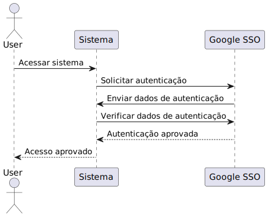
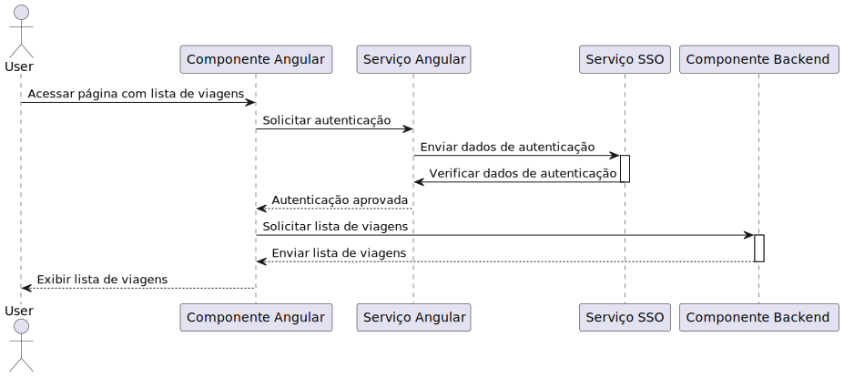

# Arquitetura

- O utilizador acede ao sistema
- O sistema solicita autenticação ao Google SSO
- O Google SSO envia os dados de autenticação para o sistema
- O sistema verifica os dados de autenticação
- O Google SSO aprova a autenticação
- O sistema aprova o acesso do utilizador

No sistema a única forma de autenticação é por SSO. Isto implica que todos os utilizadores precisarão usar as credenciais do SSO para aceder o sistema. Eles não poderão usar outras formas de autenticação, como senhas locais ou tokens de acesso.

Além disso, isso também implica que o sistema de autenticação central (que armazena as credenciais do SSO) será o único componente responsável por autenticar os utilizadores e permitir o acesso ao sistema. Os sistemas protegidos não terão acesso às senhas dos utilizadores e dependerão totalmente do sistema de autenticação central para verificar as credenciais dos utilizadores e permitir ou negar o acesso.

O componente que é responsável por armazenar os dados de utilizadores que são guardados localmente no sistema é o componente de gestão de armazéns, ou seja a base de dados mysql.
Todos os componentes estão portanto obrigados a comunicar com este modulo, o que aumenta bastante o acoplamento entre os componentes do sistema.

Para a informação relativa ao utilizador tendo em conta o SSOs são usados tokens JWT. O JWT (JSON Web Token) é um tipo de token de acesso que é usado em alguns sistemas de SSO (Single Sign-On) para permitir que os utilizadores acedam aos sistemas protegidos após a autenticação. Ele é um token criptógrafo que contém informações de autenticação, como o nome de utilizador e o ID do utilizador, e pode ser usado pelos sistemas protegidos para verificar a autenticidade do utilizador e permitir o acesso.

Ao usar o JWT no SSO, os sistemas protegidos não precisam armazenar as senhas dos utilizadores ou realizar a autenticação deles de forma independente.Em vez disso, eles podem confiar no JWT para verificar a autenticidade do utilizador e permitir o acesso. Isso torna o processo de autenticação mais seguro e eficiente, pois evita a necessidade de armazenar as senhas dos utilizadores em vários sistemas diferentes. Este é o caso do nosso sistema. Optamos, para diminuir a complexidade e aumentar a segurança, diminuir a probabilidade de falha se segurança.

Para usar o JWT no SSO, os utilizadores primeiro precisam fazer login no sistema de autenticação central usando suas credenciais. Se as credenciais forem válidas, o sistema de autenticação central gera um JWT para o utilizador e o envia de volta para o navegador do utilizador. O utilizador então pode usar esse JWT para acessar os sistemas protegidos sem precisar fazer login novamente. No nosso sistema, no frontend, o token é guardado em cookies do navegador e assim usados pelo utilizador. 
O mesmo token é enviado no request para o backend e, no caso do modulo de gestão de logística enviado para o modulo de GestArm para reconhecer o utilizador e assim permitir (ou não) a autorização do recurso ao utilizador. No caso do próprio modulo de gestão de armazéns é chamado o serviço que faz essa autorização. 