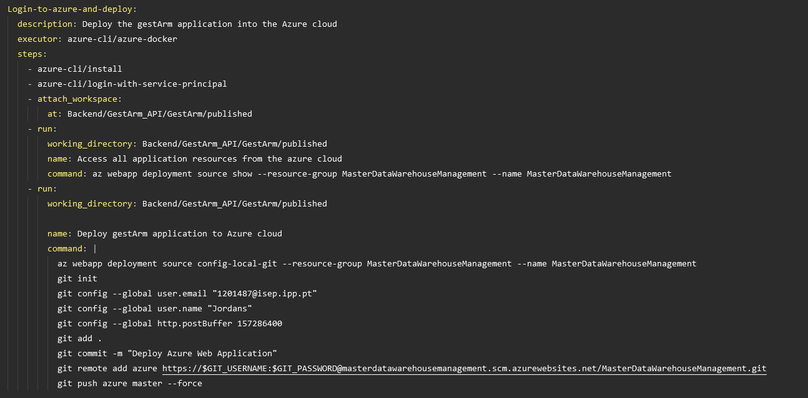

## Requisitos
    É necessário, após a realização da pipeline para o CI do nosso sistema inteiro, realizar a componente CD da nossa pipeline.
    Tal como mencionado previamente, a pipeline está a correr num servidor externo (circleCI) que vai correr, consoante os jobs descritos (build -> test) e verificar a integridade do nosso sistema.
    Para ser possível implementar o CD na pipeline o grupo decidiu utilizar a cloud da Azure para hospedar todas as nossas aplicações e serviços necessários para ser possível realizar os requesitos estabelecidos.

    O grupo decidiu dar deploy à aplicação GestArm_API. Para tal, foi necessário primeiro criar um "App Service" na cloud da Azure e posteriormente configurar a mesma para correr o .NET SDK 6.0 (que corresponde ao atual do nosso sitema).

    Após a criação do App Service e configuração do mesmo, começamos a tratar do job na nossa pipeline para dar deploy para esta mesma máquina.

 

    Após darmos commit dos ficheiros todos necessários apos o **dotnet publish** para a pasta **/published** os ficheiros vão todos para a APP service e vão ser corridos lá dentro disponibilizando assim a nossa API de forma remota.
    
## Fluxo de Eventos
    1. Qualquer membro da equipa de desenvolvimento ao dar push do repositório local para o remoto vai disparar um trigger que vai fazer com que o servidor CircleCI de checkout ao código e comece de forma sistemática a verificar a integridade do código mais recente do repositório.
    2. Após verificar a integridade vai se logar à cloud da Azure através de um service application principal e vai ligar-se à respetiva máquina.
    3. Posteriormente vai compilar o código lá dentro e disponibilizar a aplicação.
