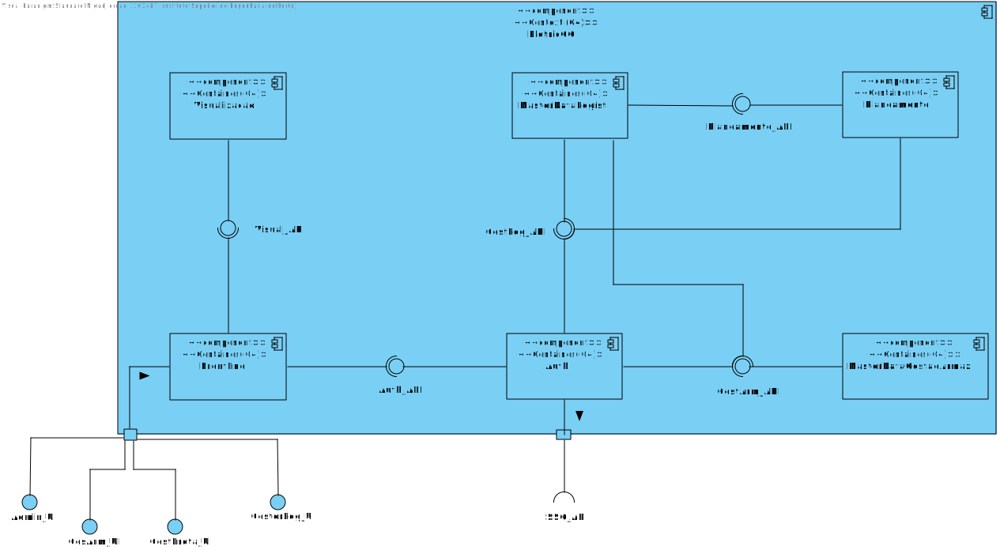
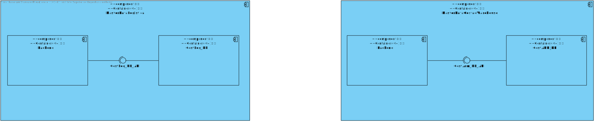
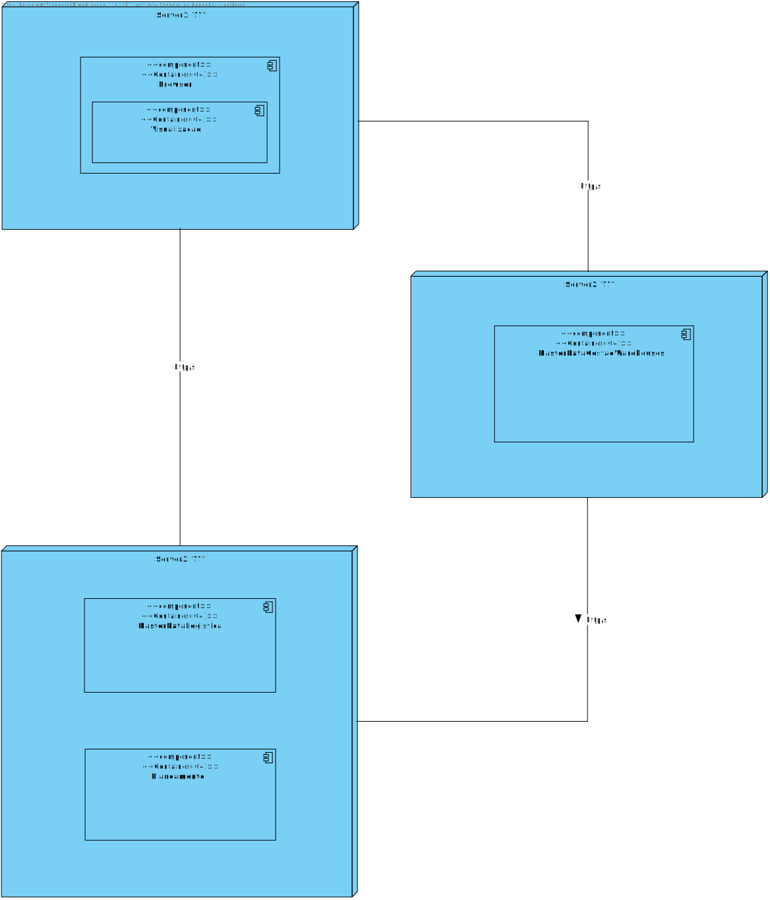

###

## Contents

- [Views](#views)
- [Nível 1](#nível-1)
	- [Vista Lógica](#vista-lógica)
		- [Vista de Cenários](#vista-de-cenários)
- [Nível 2](#nível-2)
	- [Vista Lógica](#vista-lógica-1)
			- [Analise das alternativas](#analise-das-alternativas)
		- [Alternativa 1](#alternativa-1)
		- [Alternativa 2](#alternativa-2)
		- [Alternativa 3](#alternativa-3)
		- [Alternativa 2.5](#alternativa-25)
	- [Vista de Implementação](#vista-de-implementação)
	- [Vista Física](#vista-física)
		- [Alternativa 1](#alternativa-1-1)

## Introduction

Será adotada a combinação de dois modelos de representação arquitetural: C4 e 4+1.

O Modelo de Vistas 4+1 [[Krutchen-1995]](References.md#Kruchten-1995) propõe a descrição do sistema através de vistas complementares permitindo assim analisar separadamente os requisitos dos vários stakeholders do software, tais como utilizadores, administradores de sistemas, project managers, arquitetos e programadores. As vistas são deste modo definidas da seguinte forma:

- Vista lógica: relativa aos aspetos do software visando responder aos desafios do negócio;
- Vista de processos: relativa ao fluxo de processos ou interações no sistema;
- Vista de desenvolvimento: relativa à organização do software no seu ambiente de desenvolvimento;
- Vista física: relativa ao mapeamento dos vários componentes do software em hardware, i.e. onde é executado o software;
- Vista de cenários: relativa à associação de processos de negócio com atores capazes de os espoletar.

O Modelo C4 [[Brown-2020]][References.md#Brown-2020]([C4-2020)](References.md#C4-2020) defende a descrição do software através de quatro níveis de abstração: sistema, contentor, componente e código. Cada nível adota uma granularidade mais fina que o nível que o antecede, dando assim acesso a mais detalhe de uma parte mais pequena do sistema. Estes níveis podem ser equiparáveis a mapas, e.g. a vista de sistema corresponde ao globo, a vista de contentor corresponde ao mapa de cada continente, a vista de componentes ao mapa de cada país e a vista de código ao mapa de estradas e bairros de cada cidade.
Diferentes níveis permitem contar histórias diferentes a audiências distintas.

Os níveis encontram-se definidos da seguinte forma:

- Nível 1: Descrição (enquadramento) do sistema como um todo;
- Nível 2: Descrição de contentores do sistema;
- Nível 3: Descrição de componentes dos contentores;
- Nível 4: Descrição do código ou partes mais pequenas dos componentes (e como tal, não será abordado neste DAS/SAD).

Pode-se dizer que estes dois modelos se expandem ao longo de eixos distintos, sendo que o Modelo C4 apresenta o sistema com diferentes níveis de detalhe e o Modelo de Vista 4+1 apresenta o sistema de diferentes perspetivas. Ao combinar os dois modelos torna-se possível representar o sistema de diversas perspetivas, cada uma com vários níveis de detalhe.

Para modelar/representar visualmente, tanto o que foi implementado como as ideias e alternativas consideradas, recorre-se à Unified Modeling Language (UML) [[UML-2020]](References.md#UML-2020) [[UMLDiagrams-2020]](References.md#UMLDiagrams-2020).

# Views

# Nível 1

## Vista Lógica

Neste nível, o sistema é representado como um todo, sem detalhes de implementação. Apenas são apresentados os elementos que compõem o sistema, as suas relações e as suas responsabilidades.

É possivel identificar os diversos atores que interagem com o sistema, apos analise dos requisitos, e as suas relações com o sistema.

Irá ser usada uma API externa, essa API é uma API de SSO (Single Sign On), que permite a autenticação de utilizadores em vários serviços, e que será usada para autenticar os utilizadores no sistema.

### Vista de Cenários

É possivel identificar os diversos atores que interagem com o sistema, assim como as suas relações com o sistema.

# Nível 2

## Vista Lógica

#### Analise das alternativas

Como é possivel analisar nas imagens abaixo existem algumas abordagens diferentes para a arquitetura do sistema.
Quanto ao moldulo de autenticação, existem duas abordagens, uma em que a autenticação é feita no modulo de front-end  e outra em que criamos um modulo especifico para a autenticação. Esta abordagem tambem usa o modulo de autenticação como proxy para o modulo de back-end, ou seja, todos os pedidos ao modulo de back-end são feitos pelo modulo de autenticação. Esta abordagem reduz a coesão entre os modulos de back-end e o front-end, pois estes não tem de se preocupar com a forma como o utilizador se autentica, apenas com a forma como o pedido é feito. Esta abordagem tambem permite que o modulo de autenticação seja facilmene substituido por outro modulo de autenticação, por exemplo, se quisermos adicionar suporte a outro tipo de autenticação SSO diferente do que iremos usar. Quanto a responsabilidade de redirecionar o request para o modulo de back-end, a abordagem em que essa é responsabilidade do modulo de autenticação permite desacoplar o modulo de front-end do modulo de back-end, permitindo que o modulo de front-end seja facilmente substituido por outro modulo de front-end, por exemplo, se quisermos adicionar suporte a outro tipo de front-end, como uma aplicação mobile. Existe o inconveniente desta abordagem ser mais complexa, pois temos mais modulos a gerir, mas a vantagem de ser mais facilmente substituivel e desacoplado compensa esse inconveniente.

Quanto á comunicação entre os modulos, existem duas abordagens no aspeto da comunicação entre o modulo de planeamento e o modulo de gestão de armazens, o modulo de planeamento, uma vez que é chamado pelo modulo de logistica, pode fazer pedidos dos dados necessários ao modulo de gestão de armazens, ou o modulo de logistica pode fazer pedido previamente dos dados necessários ao modulo de gestão de armazens e posteriormente fazer o pedido ao modulo de planeamento. Na alternativa em que o modulo de planeamento faz pedidos ao modulo de gestão de armazens estamos a aumentar o acopulamento entre os modulos, uma vez que o modulo de planeamento depende do modulo de gestão de armazens, fazendo assim tanto o modulo de logistica como o de planeamento dependerem do modulo de gestão de armazens. Na alternativa em que o modulo de logistica faz pedidos ao modulo de planeamento, estamos a diminuir o acopulamento entre os modulos, uma vez que o modulo de planeamento não depende do modulo de gestão de armazens, fazendo assim apenas o modulo de logistica depender do modulo de gestão de armazens. No entanto esta abordagem tem um problema, a interface entre o modulo de planeamento e o modulo de logistica tem que conter todos os dados necessários para o modulo de planeamento, o que pode ser um problema caso o modulo de planeamento precise de mais dados que os que o modulo de logistica fornece. Porem analisando as duas alternativas, a segunda parece ser a melhor, uma vez que o modulo de planeamento não depende do modulo de gestão de armazens, o que torna o sistema mais flexivel e mais facil de manter.

### Alternativa 1

### Alternativa 2

### Alternativa 3

### Alternativa 2.5

Decidiu-se representar a base de dados não como um container, nem como um component, o facto de existir uma base de dados diferente para cada modulo, e o facto de cada modulo ter uma base de dados diferente, faz com que a base de dados não seja um modulo, e sim um recurso que é usado pelos modulos. Poderia ser representada como um component mas uma vez que não é  desenvolvida por nós, a equipa decidiu representar a base de dados como algo intermedio entre um container e um component, uma vez que é um recurso que é usado pelos modulos, mas que não é desenvolvido por nós.

## Vista de Implementação

Quanto á implentação, cada um dos modulos é desenvolvido numa tecnologia diferente:
 
- Modulo de autenticação: desenvolvido em Java com Spring Boot
 
- Modulo de front-end: desenvolvido em Angular
 
- Modulo de Gestão de Armazens: desenvolvido em C# com .NET Core
 
- Modulo de Logistica: desenvolvido em typescript com Node.js
 
- Modulo de Planeamento: desenvolvido em Prolog

## Vista Física

### Alternativa 1

O edializado para o deployment do sistema é a instalação de cada serviço em containers virtuais separados, podendo ou não estar a correr no mesmo servidor. Quanto ás bases de dados estas são totalmente remotas, estado a correr nos servidores virtual do DEI, no entanto em ambientes de produção estas poderiam estar a correr em servidores dedicados, sendo este um ponto a prestar atenção em proximos ciclos de desenvolvimento.

Os modulos comunicação entre si atraves de requests REST, estando a listas dos endpoints no ficheiro [API.md](APIList.md).

## Vista de Implementação

### Alternativa 1

### Alternativa 2

### Alternativa 3
