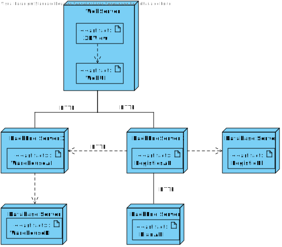
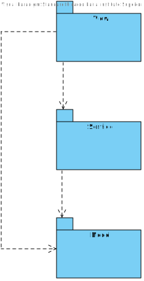

# Requisitos
Os dados da listagem já foram definidos em outras USs.

- O que acontece se o utilizador não preencher algum campo obrigatório? **O sistema não permite a criação da entrega e mostra uma mensagem de erro.**

O utilizador deve estar autenticado como WarehouseManager para criar uma entrega. Neste momento, a autenticação não está implementada. Existe um mock de autenticação que permite que o utilizador seja autenticado como WarehouseManager. No próximo sprint, a autenticação será implementada.

# Fluxo de Eventos
1. O utilizador acessa a página de criação de entrega.
2. O sistema exibe um formulário com todas as informações necessárias a serem preenchidas para ser possível criar e entrega.
3. O usário introduz/seleciona todas as informações e clica no botão "Create".
4. O sistema cria a entrega, é mostrada uma mensagem pop-up a indicar o sucesso da sua criação e o seu ID e redireciona o utilizador para a home page.

# Integração
O Front-end deve enviar um request para o Back-end com os dados inseridos pelo utilizador para a criação da entrega.
O Back-end deve, a partir dos dados recebidos, criar a entrega, persistí-la na base de dados correspondente e responder ao pedido com uma mensagem de sucesso ou insucesso respetivamente.

Na barra de navegação, o utilizador pode clicar no botão "Create Order". O sistema exibe um formulário extenso com todas as informações necessárias.
Dois atributos do formulário são de seleção (data da entrega e ID do armazém) para facilitar a criação da entrega.

# Vistas
# Nível 1

## Vista de cenários

## Vista de processos

# Nível 2

## Vista de processos

## Vista Física

# Nível 3

## Vista de processos

 

### **Front-end**

 

### **Back-end**

## Vista de implementação

## Vista Lógica

