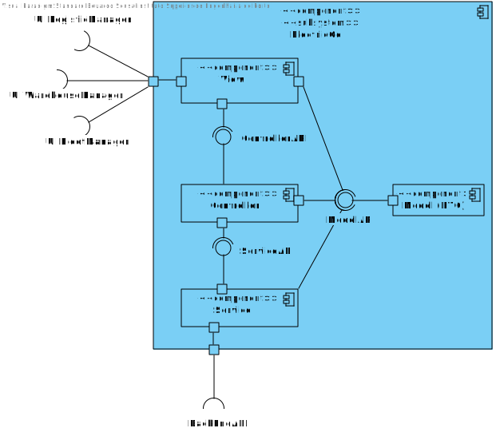

# Requisitos
Os dados da listagem já foram definidos em outras USs.

- O que acontece se o usuário não preencher algum campo obrigatório? **O sistema não permite a criação do empacotamento e mostra uma mensagem de erro.**

O Usuário deve estar autenticado como LogisticManager para listar os camiões. Neste momento, a autenticação não está implementada. Existe um mock de autenticação que permite que o usuário seja autenticado como LogisticManager. No próximo sprint, a autenticação será implementada.

# Fluxo de Eventos
1. O usuário acessa a página de listagem de camiões.
2. O sistema exibe um formulário com todas as informações necessárias a serem preenchidas para ser possível criar o empacotamento.
3. O usário introduz todas as informações e clica no botão "create".
4. O sistema cria o empacotamento e redireciona o usário para a home page.

# Integração
O FrontEnd deve enviar um request para o BackEnd com os dados inseridos pelo utilizador para a criação do empacotamento.
O BackEnd deve, a partir dos dados recebidos, criar o empacotamento, persiti-lo na base de dados correspondente e responde ao pedido com uma mensagem de sucesso ou insucesso respetivamente.

Na barra de navegação, o usuário pode clicar no botão Add Packaging. O sistema exibe um formulário extenso com todas as informações necessárias.
Dois atributos do formulário são de seleção para facilitar a criação do empacotamento.

# Vistas
# Nível 1

## Vista de cenários

## Vista de processos

# Nível 2

## Vista de processos

## Vista Física

# Nível 3

## Vista de processos

### **FRONT END**
 

### **BACK END**
 

## Vista de implementação

## Vista Lógica

