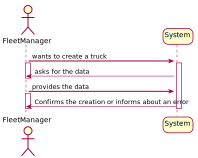
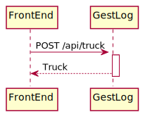
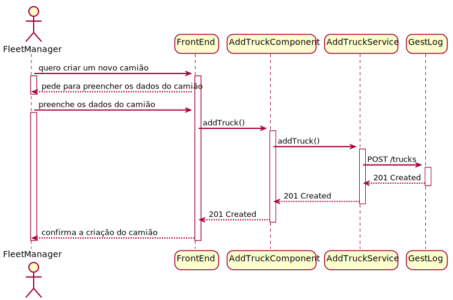

## Requisitos
Os dados do objeto já foram definidos noutras USs. 

- Como são inseridos os dados no formulário? **Os dados são inseridos na caixa de texto correspondente.**

- O que acontece se o usuário não preencher algum campo obrigatório? **O sistema não permite a criação do camião e mostra uma mensagem de erro**

- O que acontece se o usuário preencher um campo com um valor válido? **O sistema permite a criação do camião e retorna à página anterior.**

O Usuário deve estar autenticado como FleetManager para criar um camião. Neste momento, a autenticação não está implementada. Existe um mock de autenticação que permite que o usuário seja autenticado como FleetManager. No próximo sprint, a autenticação será implementada.

## Fluxo de Eventos
1. O usuário acessa a página de criação de camião. 
2. O sistema exibe o formulário de criação de camião.
3. O usuário preenche os campos do formulário e clica no botão de criar camião.
4.  É feito um request para o servidor com os dados do camião.
5.  O servidor recebe o request e cria o camião.
6.  O servidor retorna uma mensagem de sucesso.
7.  O FrontEnd redireciona o utilizador para a página do FleetManager.

## Integração
O FrontEnd deve enviar um request para o BackEnd com os dados do camião. O BackEnd deve criar o camião e retornar uma mensagem de sucesso.

Na barra de navegação, o usuário pode clicar no botão de criar camião. O sistema exibe a página de criação de camião. 

Em termos de Design, é apresentado nos diagramas a parte de FrontEnd apenas, já que a parte de BackEnd está já descrita noutras USs.

## Vistas

### Vista de Processo

#### Nível 1

#### Nível 2

#### Nível 3

