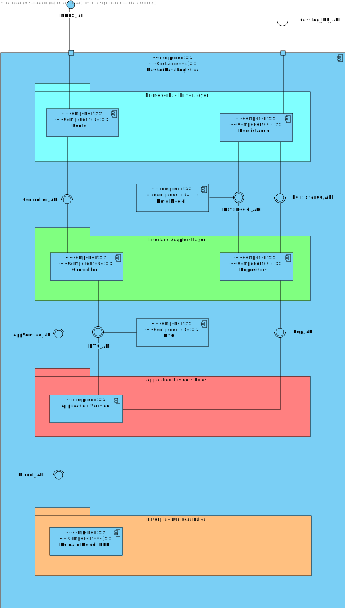

# Criar Armazém

## Contents
- [Views](#views)
    - [Requesitos](#introduction)
    - [Fluxo de Eventos](#fluxo-de-eventos)
    - [Integração](#integracao)
    - [Nível 1](#nível-1)
        - [Vista Lógica](#vista-lógica)
        - [Vista de Processos](#vista-de-processos)
    - [Nível 2](#nível-2)
        - [Vista Lógica](#vista-lógica-1)
        - [Vista de Processos](#vista-de-processos)
        - [Vista de Implementação](#vista-de-implementação)
    - [Nível 3 (MDR)](#nível-3-mdr)
        - [Vista Lógica](#vista-lógica-2)
        - [Vista de Processos](#vista-de-processos-1)
        - [Vista de Implementação](#vista-de-implementação-1)
    - [Lista de Funcionalidades](Planeamento.md)

## Requisitos
Os dados do objeto já foram definidos noutras USs. 

- Como são inseridos os dados no formulário? **Os dados são inseridos na caixa de texto correspondente.**

- O que acontece se o usuário não preencher algum campo obrigatório? **O sistema não permite a criação do camião e mostra uma mensagem de erro**

- O que acontece se o usuário preencher um campo com um valor válido? **O sistema permite a criação do camião e retorna à página anterior.**

O Usuário deve estar autenticado como WarehouseManager para criar um camião. Neste momento, a autenticação não está implementada. Existe um mock de autenticação que permite que o usuário seja autenticado como Manager. No próximo sprint, a autenticação será implementada.

## Fluxo de Eventos
1. O usuário acessa a página de criação de Armazém. 
2. O sistema exibe o formulário de criação de armazém.
3. O usuário preenche os campos do formulário e clica no botão de criar armazém.
4.  É feito um request para o servidor com os dados do armazém.
5.  O servidor recebe o request e cria o armazém.
6.  O servidor retorna uma mensagem de sucesso.
7.  O FrontEnd redireciona o utilizador para a página do WarehouseManager.

## Integração
O FrontEnd deve enviar um request para o BackEnd com os dados do armazém. O BackEnd deve criar o armazém e retornar uma mensagem de sucesso.

Na barra de navegação, o usuário pode clicar no botão de criar armazém. O sistema exibe a página de criação de armazém. 

#Nível 1

## Vista Logica

##Vista de Processos

#Nível 2

##  Vista Lógica

##Vista de Processos

## Vista de Implementação

#Nivel 3

##Vista Logica

###Alt 1

###Alt 2

##Vista de Processos

##Vista de Implementação

