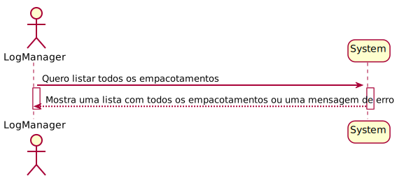
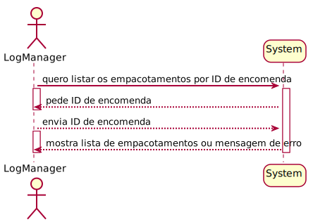
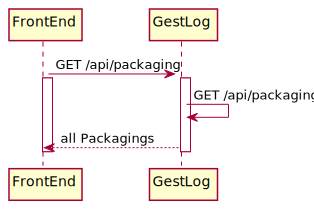
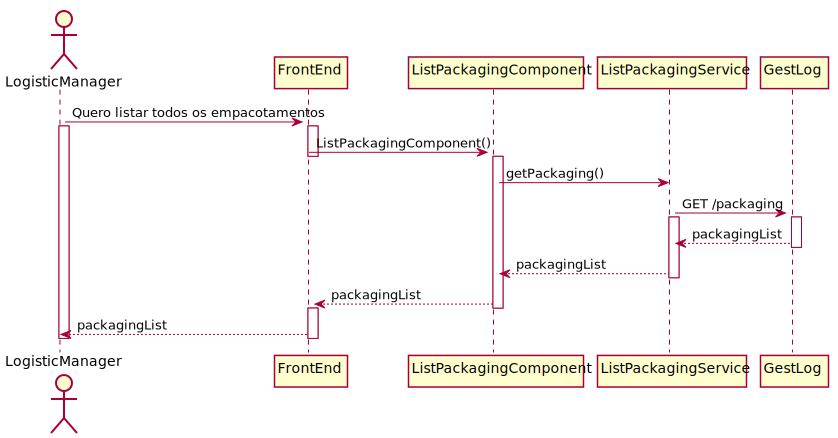
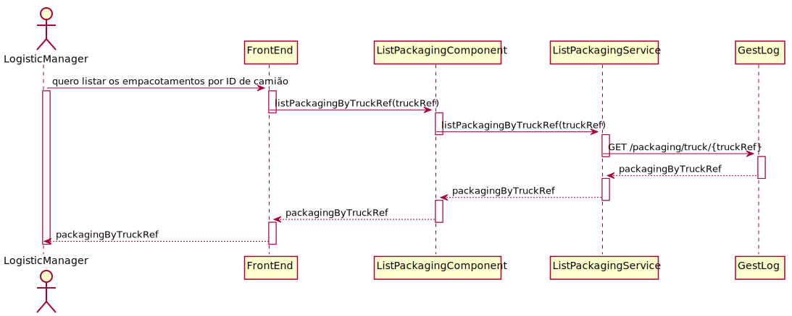
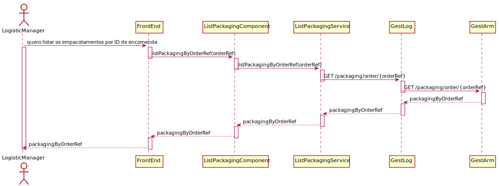

## Requisitos
Os dados da listagem já foram definidos em outras USs. 

- O que acontece se o usuário não preencher algum campo obrigatório? **O sistema não permite a criação do caminho e mostra uma mensagem de erro.**

O Usuário deve estar autenticado como LogisticManager para listar os empacotamentos. Neste momento, a autenticação não está implementada. Existe um mock de autenticação que permite que o usuário seja autenticado como LogisticManager. No próximo sprint, a autenticação será implementada.

## Fluxo de Eventos
# Alternativa 1
1. O usuário acessa a página de listagem de empacotamentos. 
2. O sistema exibe uma lista de empacotamentos.

# Alternativa 2
1. O usuário acessa a página de listagem de empacotamentos por ID de camião.
2. O sistema exibe uma lista de empacotamentos com esse ID de camião.

# Alternativa 3
1. O usuário acessa a página de listagem de empacotamentos por ID de order.
2. O sistema exibe uma lista de empacotamentos com esse ID de order.

## Integração
O FrontEnd deve enviar um request para o BackEnd com os dados da listagem.
O BackEnd deve listar os empacotamentos e retornar uma mensagem de sucesso.

Na barra de navegação, o usuário pode clicar no botão de listar empacotamentos. O sistema exibe uma lista de empacotamentos. 

Em termos de Design, é apresentado nos diagramas a parte de FrontEnd apenas, já que a parte de BackEnd está já descrita noutras USs.

## Vistas

### Vista de Processo

#### Nível 1

#### Nível 2

#### Nível 3

