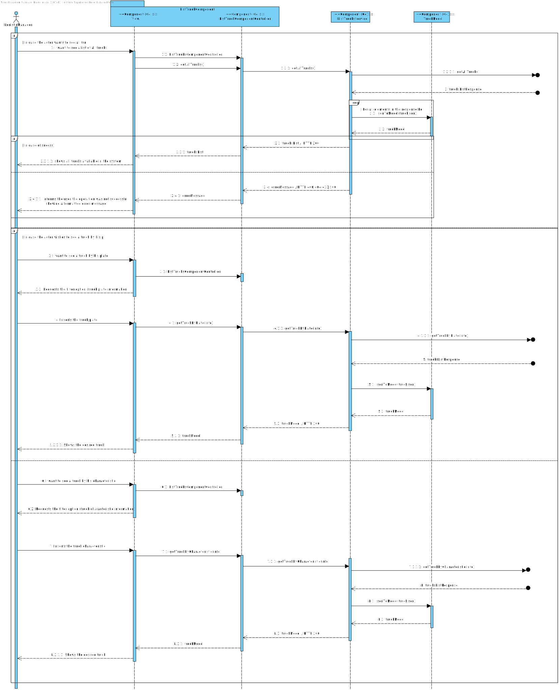

# Requisitos
Os dados da listagem já foram definidos em outras USs. 

- O que acontece se o usuário não preencher algum campo obrigatório? **O sistema não permite a filtragem dos camiões e mostra uma mensagem de erro.**

O Usuário deve estar autenticado como LogisticManager para listar os camiões. Neste momento, a autenticação não está implementada. Existe um mock de autenticação que permite que o usuário seja autenticado como LogisticManager. No próximo sprint, a autenticação será implementada.

# Fluxo de Eventos
## Alternativa 1
1. O usuário acessa a página de listagem de camiões.
2. O sistema exibe uma lista com todos os camiões.

## Alternativa 2
1. O usuário acessa a página de listagem de camiões.
2. O sistema exibe uma lista com todos os camiões.
3. O usário escolhe uma filtragem por matrícula do camião.
4. O sitema mostra o camião com aquela matrícula associada.

## Alternativa 3
1. O usuário acessa a página de listagem de camiões. 
2. O sistema exibe uma lista com todos os camiões.
3. O usário escolhe uma filtragem por característica do camião.
4. O sitema mostra o camião com aquela característica associada.

# Integração
O FrontEnd deve enviar um request para o BackEnd com os dados da listagem.
O BackEnd deve listar os camiões e retornar uma mensagem de sucesso.

Na barra de navegação, o usuário pode clicar no botão de listar camiões. O sistema exibe uma lista de camiões.
Para além disso, como mencionado, existe opções de filtragem, estando estas presentes numa lista em que o usário consegue selecionar e posteriormente escrever o texto correspondente à filtragem.

# Vistas
# Nível 1

## Vista de cenários

## Vista de processos

# Nível 2

## Vista de processos

### **FRONT END**
 

### **BACK END**
 

## Vista Física

# Nível 3

## Vista de processos

## Vista de implementação

## Vista Lógica

