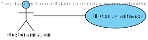
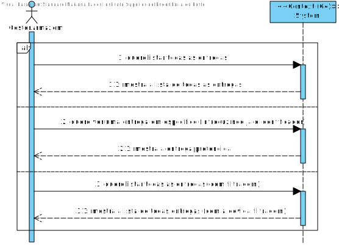
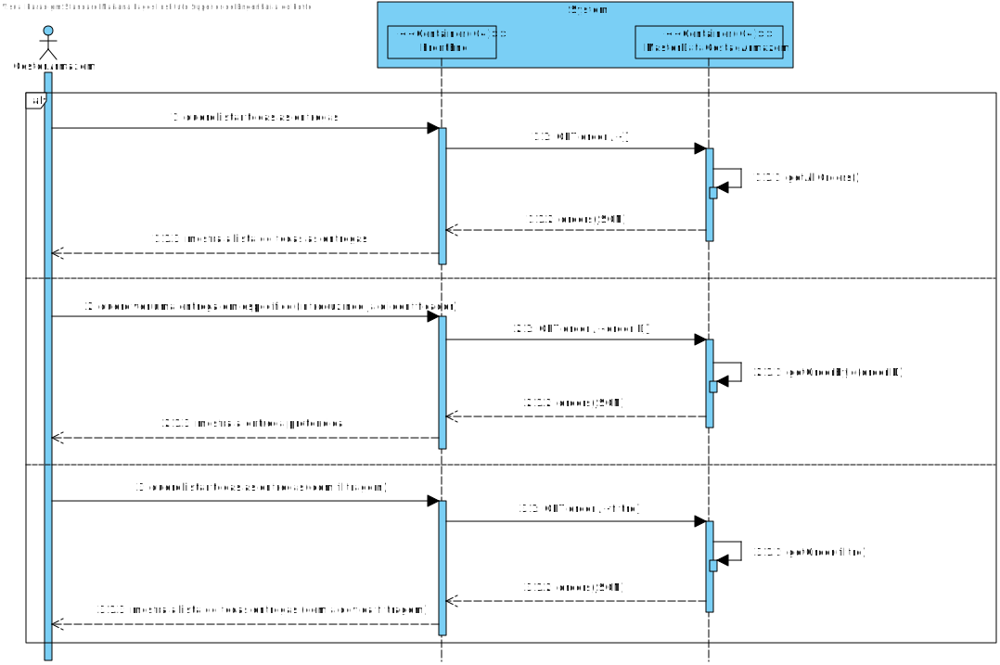
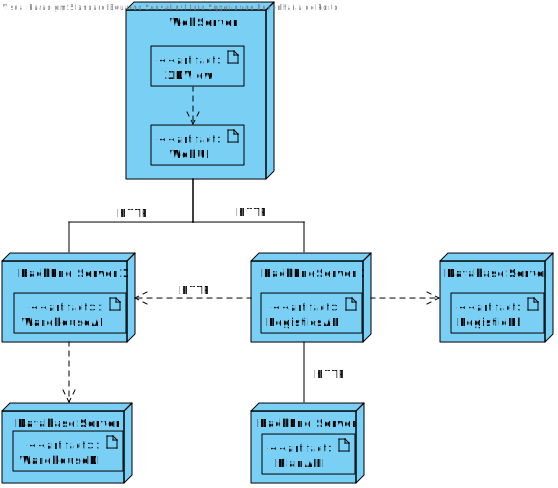
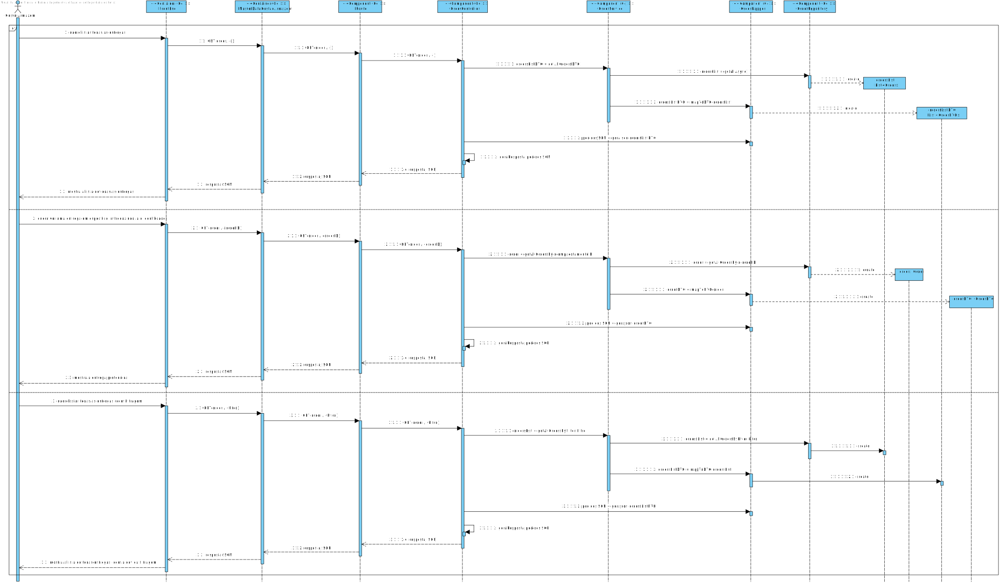
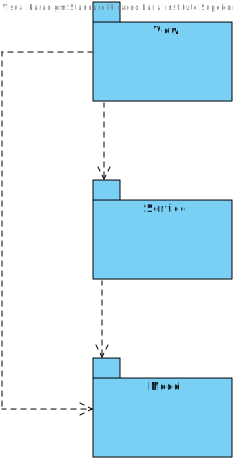
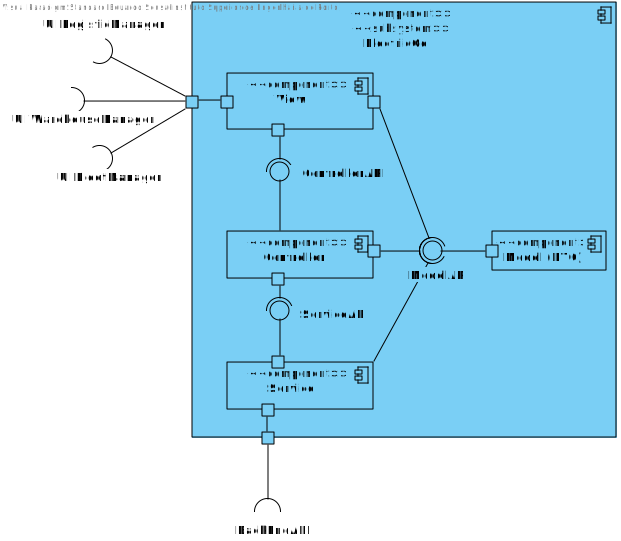

## Requisitos
Os dados da listagem já foram definidos em outras USs. 

O utilizador deve estar autenticado como WarehouseManager para listar as entregas. Neste momento, a autenticação não está implementada. Existe um mock de autenticação que permite que o utilizador seja autenticado como WarehouseManager. No próximo sprint, a autenticação será implementada.

## Fluxo de Eventos
# Alternativa 1
1. O utilizador acessa a página de listagem de entregas. 
2. O sistema exibe a lista de entregas.

# Alternativa 2
1. O utilizador acessa a página de listagem de entregas por ID de entrega.
2. O sistema exibe a lista de entregas com esse ID de entrega.

# Alternativa 3
1. O utilizador acessa a página de listagem de entregas por data de entrega.
2. O sistema exibe a lista de entregas com essa data de entrega.

# Alternativa 4
1. O utilizador acessa a página de listagem de entregas por ID de armazém.
2. O sistema exibe a lista de entregas com esse ID de armazém.

# Alternativa 5
1. O utilizador acessa a página de listagem de entregas por data de entrega e ID de armazém.
2. O sistema exibe a lista de entregas com essa data de entrega e ID de armazém.

## Integração
O Front-end deve enviar um request para o Back-end com os dados da listagem.
O Back-end deve listar as entregas e retornar uma mensagem de sucesso/erro.

Na barra de navegação, o utilizador pode clicar no botão de "List Orders". O sistema exibe uma lista de entregas. 

Em termos de Design, é apresentado nos diagramas a parte de Front-end apenas, uma vez que a parte de Back-end está já descrita em outras USs.

## Vistas

## Nível 1

### Vista de cenários

### Vista de processos

## Nível 2

### Vista de processos

### Vista Física

## Nível 3

### Vista de processos

### Vista de implementação

### Vista Lógica

