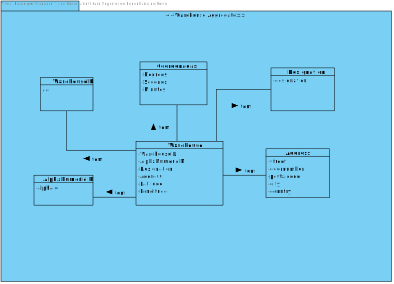
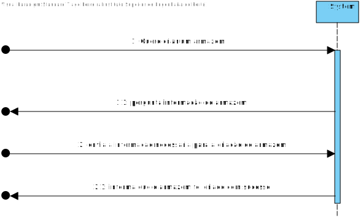
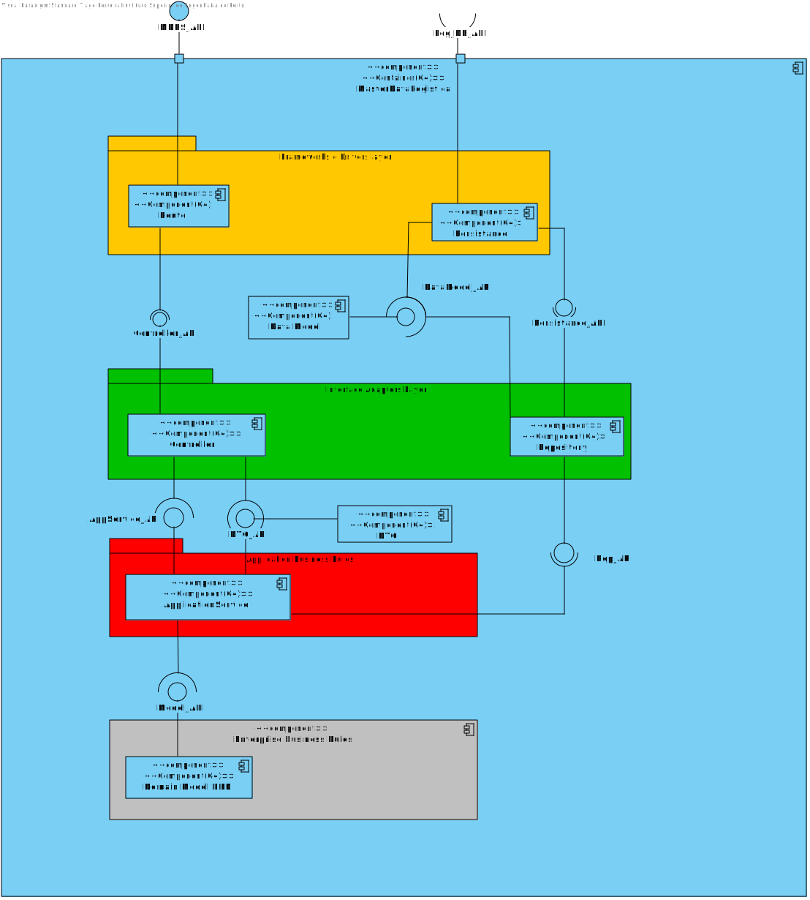
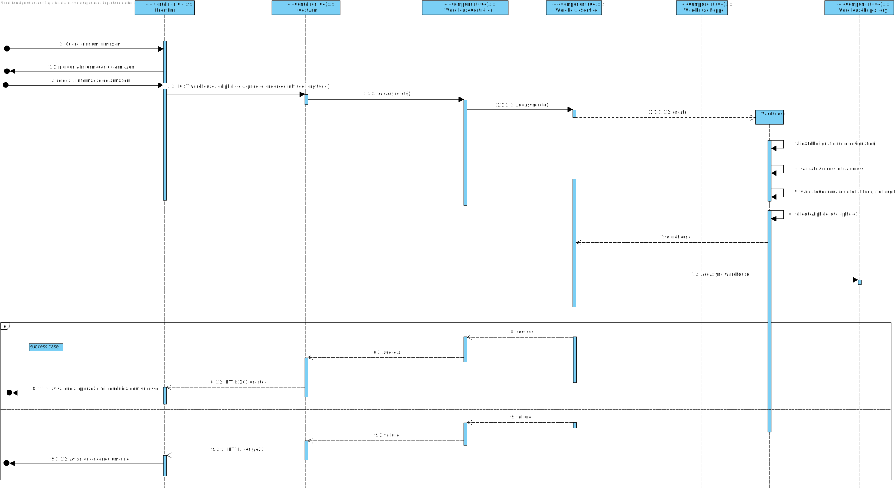

# UC 1

## 1. Requisitos
As Warehouse Employee, I want to create a Warehouse.

###Acceptance Criteria

**AC1:** A identificação do armazém é um código único alfanúmerico com 3 caracteres.

**AC2:** Endereço do Armazem tem de indicar a rua, número de porta, código postal, endereço da cidade e país.

**AC3:** Latitude e Longitude devem ser apresentado por grau,minuto e segundos.

## 2. Análise

## 2.1. Informação

Segundo os requesitos do cliente, o armazém terá de ser desenvolvido através de uma API em dotnet, usando a linguagem C#.
Iremos testar a criação do Armazém fazendo Post Requests á API através do software PostMan pois ainda não temos o FrontEnd implementado.

## 2.2. Análise

Esta é a estrutura de analise de armazém que chegamos segundo o cliente:

Como podemos observar os objetos: Latitude e Longitude pertencem ao mesmo objeto Coordenadas,
sendo que o objeto Coordenadas está a usar a estrutura de graus,minutos e segundos, o objeto também
tem as regras de negócio implementadas.

O ArmazemID será o ID de identificação na Base de Dados, já o Alpha Numeric ID é a identificação
de negócio pedida pelo cliente.

Numa interação entre cliente e sistema, sem entrar muito em design, o cliente pede
ao sistema que deseja criar um armazem e o sistema pede as informações dele. Após o cliente
colocar corretamente as informações do Armazem, este entrará na base de dados com sucesso.

Como atualmente não há tecnicamente nenhuma UI nem roles pois nesta fase do projeto as USs
são testadas através de requests, assumimos que estes pedidos venham de um software que envie requests.

## 3. Design

# 3.1 Informação

 A arquitetura usada para a realização desta US foi o DDD (Domain-Driven Design), onde
o Controller dos Armazéms recebe os requests do cliente e converte o body da request nos objetos
necessários para o funcionamento da US, o Controller irá chamar o Service que será responsável em exercer as funções necessárias
para a satisfação da US. O Service chamará o repositório que fará as comunicações necessárias com a Base de dados.

# 3.2 Vistas de Design

Como podemos obervar no VP, após o POST request que o cliente envia á API, o Controller converte o corpo num DTO, este será enviado para o Service,
o service terá a responsabilidade de construir o objeto Armazém, o Domínio terá a responsabilidade de verificar se os atributos dos objetos respeitam
as regras de negócio do cliente, após o Service ter fabricado o objeto, irá enviar para o repositório que terá o objetivo
de fazer as comunicações necessárias para adicionar o objeto á Base de Dados.

No fim se tudo correr como foi mencionado, a API enviará ao cliente um 200 OK avisando que o sistema
fez a operação com sucesso se não enviará um 400 avisando que algo da request do cliente não estã bem estruturado ou não
respeita as regras de negócio do cliente.

# 3.3 Padrões Aplicados

* DDD (Persistence Ignorance, Entity, Value Object, Domain Service, Aggregate, Domain Event, Observer, Events);
* GRASI (Information Expert, Creator, Controller, Low Coupling (evaluative), High Cohesion (evaluative), Polymorphism, Pure Fabrication, Indirection, Protected Variations);
    + Information Expert - The service, since has a direct connection with the repositories, in this case, knows all domain concepts from this specific Use Case;
    + Low Coupling and High Cohesion, since we are using a lot of structured layers, all with a specific meaning, we are applying this pattern aswell;

* Data Transfer Object (DTO) pattern;
    + In order to abstract the entities and value objects from the domain layer or business layer we implement DTOs to abstract the UI Layer from the Domain Layer;

## Tests

### Integration Testing

* Adiciona um armazem, através do AddSync devolvendo um DTO

  
    [Fact]
    public void AddAsyncIntegrationTest_ShouldAddAnArmazem()
    {
  

    //ARRANGE
    var arm = new Armazem(new ArmazemId(Guid.NewGuid()), new CoordenadasArmazem(10, 20, 30), new CoordenadasArmazem(10, 30, 40),new DesignacaoArmazem("Designação teste"),
    new EnderecoArmazem("Rua das flores", 1, "4000-300", "Pourto", "Pourtougal"), new AlphaId("A12"));
    var creatingDto =   new CreatingArmazemDto(10, 20, 30, 
              10, 30, 40, "Designação teste", "Rua das flores",
              1, "4000-300", "Pourto", "Pourtougal", "A12");

        
        //ACT
        _repositoryMock.Setup(x => x.AddAsync(arm)).ReturnsAsync(arm);
        var result = _controller.AddAsync(creatingDto).Result;

        var objExpected = result.Value;
        var objActual = ArmazemDtoParser.convertToDto(arm);
        
        objActual.Id = objExpected.Id;
        
        var obj1StrExpected = JsonConvert.SerializeObject(objExpected);
        var obj2StrActual = JsonConvert.SerializeObject(objActual);
        
        //ASSERT
        Assert.Equal(obj1StrExpected, obj2StrActual);
    

###Unit Testing

####Controller Testing
* Adicionar um Armazem 

    [Fact]
    public void AddAsyncTest_ShouldAddAnArmazem()
    {
    

    //ARRANGE
  
  
    var arm = new Armazem(new ArmazemId(Guid.NewGuid()),
    new CoordenadasArmazem(12, 13, 14),
    new CoordenadasArmazem(15, 12, 13),
    new DesignacaoArmazem("Designação teste"),
    new EnderecoArmazem("Rua das flores", 1, "4000-300", "Pourto", "Pourtougal"),
    new AlphaId("A12"));

          var armDto = ArmazemDtoParser.convertToDto(arm);

          CreatingArmazemDto createDTO = new CreatingArmazemDto(12, 13, 14, 15, 12, 13, "Designação teste",
          "Rua das flores", 1, "4000-300", "Pourto", "Pourtougal", "A12");
        
          //ACT
          _ServiceMock.Setup(x => x.AddAsync(createDTO)).ReturnsAsync(armDto);
          var result = _controller.AddAsync(createDTO).Result;

          var objExpected = armDto;
          var objActual = result.Value;

          var obj1StrExpected = JsonConvert.SerializeObject(objExpected);
          var obj2StrActual = JsonConvert.SerializeObject(objActual);
        
          //ACT
          Assert.Equal(obj1StrExpected, obj2StrActual);
    }

####Service Testing
* Adicionar um Armazem 

    [Fact]
    public void AddAsyncTest_ShouldAddAnArmazem()
    {
    //ASSERT
    var arm = new Armazem(new ArmazemId(Guid.NewGuid()),
    new CoordenadasArmazem(10, 20, 30),
    new CoordenadasArmazem(10, 30, 40),
    new DesignacaoArmazem("Designação teste"),
    new EnderecoArmazem("Rua das flores", 1, "4000-300", "Pourto", "Pourtougal"),
    new AlphaId("A12")); 

    CreatingArmazemDto armDto = new CreatingArmazemDto(10, 20, 30, 
                10, 30, 40, "Deisgnação teste", "Rua das flores",
                1, "4000-300", "Pourto", "Pourtougal", "A12");
        
            //ACT
            _repositoryMock.Setup(x => x.AddAsync(arm)).ReturnsAsync(arm);

            var resultDTO = ArmazemDtoParser.convertToDto(arm);
            var result = _service.AddAsync(armDto).Result;

            var obj1StrExpected = JsonConvert.SerializeObject(result.ToString());
            var obj2StrActual = JsonConvert.SerializeObject(resultDTO.ToString());

            //ASSERT
            Assert.Equal(obj1StrExpected, obj2StrActual);
      }

####Domain

  * Create a Valid Armazem Test

    [Fact]
    public void CreateValidArmazemTest_ShouldCreateAValidArmazem()
    {
    var arm = new Armazem(new ArmazemId(Guid.NewGuid()),
    new CoordenadasArmazem(10, 20, 30),
    new CoordenadasArmazem(10, 30, 40),
    new DesignacaoArmazem("Designação teste"),
    new EnderecoArmazem("Rua das flores", 1, "4000-300", "Pourto", "Pourtougal"),
    new AlphaId("A12"));

        Assert.NotNull(arm);
    }

  * Create Armazem Invalid ID Test
  

 

      [Fact]
    public void CreateArmazemWithInvalidArmazemIdTest_ShouldThrowsANullReferenceException()
    {
    Assert.Throws<NullReferenceException>(() =>
    {
    new Armazem(new ArmazemId(null),
    new CoordenadasArmazem(10, 20, 30),
    new CoordenadasArmazem(10, 30, 40),
    new DesignacaoArmazem("Designação teste"),
    new EnderecoArmazem("Rua das flores", 1, "4000-300", "Pourto", "Pourtougal"),
    new AlphaId("A12"));
    });
    }

* Create Armazem Invalid Empty ID Test

  
    [Fact]
    public void CreateArmazemWithInvalidArmazemIdStringVaziaTest_ShouldThrowsAFormatException()
    {
    Assert.Throws<FormatException>(() =>
    {
    new Armazem(new ArmazemId(""),
    new CoordenadasArmazem(10, 20, 30),
    new CoordenadasArmazem(10, 30, 40),
    new DesignacaoArmazem("Designação teste"),
    new EnderecoArmazem("Rua das flores", 1, "4000-300", "Pourto", "Pourtougal"),
    new AlphaId("A12"));
    });
    }

* Create Armazem with invalid Latitude Graus

  
      [Fact]
    public void CreateArmazemWithInvalidLatitudeGrausTest_ShouldThrowsBusinessRuleValidationException()
    {
    Assert.Throws<BusinessRuleValidationException>(() =>
    {
    new Armazem(new ArmazemId(Guid.NewGuid()),
    new CoordenadasArmazem(-190, 20, 30),
    new CoordenadasArmazem(10, 30, 40),
    new DesignacaoArmazem("Designação teste"),
    new EnderecoArmazem("Rua das flores", 1, "4000-300", "Pourto", "Pourtougal"),
    new AlphaId("A12"));
    });
    }

* Create Armazem with invalid Latitude Minutos

    [Fact]
    public void CreateArmazemWithInvalidLatitudeMinutosTest_ShouldThrowsBusinessRuleValidationException()
    {
        Assert.Throws<BusinessRuleValidationException>(() =>
        {
            new Armazem(new ArmazemId(Guid.NewGuid()),
                new CoordenadasArmazem(10, -20, 30),
                new CoordenadasArmazem(10, 30, 40),
                new DesignacaoArmazem("Designação teste"),
                new EnderecoArmazem("Rua das flores", 1, "4000-300", "Pourto", "Pourtougal"),
                new AlphaId("A12"));
        });
    }
    
* Create Armazem with invalid Latitude Segundos

  
    [Fact]
    public void CreateArmazemWithInvalidLatitudeSegundosTest_ShouldThrowsBusinessRuleValidationException()
    {
    Assert.Throws<BusinessRuleValidationException>(() =>
    {
    new Armazem(new ArmazemId(Guid.NewGuid()),
    new CoordenadasArmazem(10, 20, -30),
    new CoordenadasArmazem(10, 30, 40),
    new DesignacaoArmazem("Designação teste"),
    new EnderecoArmazem("Rua das flores", 1, "4000-300", "Pourto", "Pourtougal"),
    new AlphaId("A12"));
    });
    }

* Create Armazem with invalid Designacao

    [Fact]
    public void CreateArmazemWithInvalidDesignacaoArmazemTest_ShouldThrowsBusinessRuleValidationException()
    {
    Assert.Throws<BusinessRuleValidationException>(() =>
    {
    new Armazem(new ArmazemId(Guid.NewGuid()),
    new CoordenadasArmazem(10, 20, 30),
    new CoordenadasArmazem(10, 30, 40),
    new DesignacaoArmazem(null),
    new EnderecoArmazem("Rua das flores", 1, "4000-300", "Pourto", "Pourtougal"),
    new AlphaId("A12"));
    });
    }

* Createm Armazem with Invalid Rua

  
    [Fact]
    public void CreateArmazemWithInvalidDesignacaoEndereçoRuaTest_ShouldThrowsBusinessRuleValidationException()
    {
    Assert.Throws<BusinessRuleValidationException>(() =>
    {
    new Armazem(new ArmazemId(Guid.NewGuid()),
    new CoordenadasArmazem(-10, 20, 30),
    new CoordenadasArmazem(10, 30, 40),
    new DesignacaoArmazem("Designação teste"),
    new EnderecoArmazem("", 1, "4000-300", "Pourto", "Pourtougal"),
    new AlphaId("A12"));
    });
    }

* Createm Armazem with invalid Nr Porta

    [Fact]
    public void CreateArmazemWithInvalidDesignacaoEndereçoNumeroPortaTest_ShouldThrowsBusinessRuleValidationException()
    {
        Assert.Throws<BusinessRuleValidationException>(() =>
        {
            new Armazem(new ArmazemId(Guid.NewGuid()),
                new CoordenadasArmazem(-10, 20, 30),
                new CoordenadasArmazem(10, 30, 40),
                new DesignacaoArmazem("Designação teste"),
                new EnderecoArmazem("Rua das flores", -10, "4000-300", "Pourto", "Pourtougal"),
                new AlphaId("A12"));
        });
    }

* Create Armazem with invalid Codigo Postal

    [Fact]
    public void CreateArmazemWithInvalidDesignacaoEndereçoCodigoPostalTest_ShouldThrowsBusinessRuleValidationException()
    {
        Assert.Throws<BusinessRuleValidationException>(() =>
        {
            new Armazem(new ArmazemId(Guid.NewGuid()),
                new CoordenadasArmazem(-10, 20, 30),
                new CoordenadasArmazem(10, 30, 40),
                new DesignacaoArmazem("Designação teste"),
                new EnderecoArmazem("Rua das flores", 1, "", "Pourto", "Pourtougal"),
                new AlphaId("A12"));
        });
    }

* Create Armazem with invalid Cidade

    [Fact]
    public void CreateArmazemWithInvalidDesignacaoEndereçoCidadeTest_ShouldThrowsBusinessRuleValidationException()
    {
        Assert.Throws<BusinessRuleValidationException>(() =>
        {
            new Armazem(new ArmazemId(Guid.NewGuid()),
                new CoordenadasArmazem(-10, 20, 30),
                new CoordenadasArmazem(10, 30, 40),
                new DesignacaoArmazem("Designação teste"),
                new EnderecoArmazem("Rua das flores", 1, "4000-300", null, "Pourtougal"),
                new AlphaId("A12"));
        });
    }

* Create Armazem with invalid Pais

    [Fact]
    public void CreateArmazemWithInvalidDesignacaoEndereçoPaisTest_ShouldThrowsBusinessRuleValidationException()
    {
        Assert.Throws<BusinessRuleValidationException>(() =>
        {
            new Armazem(new ArmazemId(Guid.NewGuid()),
                new CoordenadasArmazem(-10, 20, 30),
                new CoordenadasArmazem(10, 30, 40),
                new DesignacaoArmazem("Designação teste"),
                new EnderecoArmazem("Rua das flores", 1, "4000-300", "Pourto", ""),
                new AlphaId("A12"));
        });
    }

* Create invalid AlphaIdTest

    [Fact]
    public void CreateArmazemWithInvalidAlphaIdTest_ShouldThrowsBusinessRuleValidationException()
    {
        Assert.Throws<BusinessRuleValidationException>(() =>
        {
            new Armazem(new ArmazemId(Guid.NewGuid()),
                new CoordenadasArmazem(-10, 20, 30),
                new CoordenadasArmazem(10, 30, 40),
                new DesignacaoArmazem("Designação teste"),
                new EnderecoArmazem("Rua das flores", 1, "4000-300", "Pourto", "Pourtougal"),
                new AlphaId("AAAAAAAAA"));
        });
    }

## System Test

					"name": "Armazem Entity",
					"item": [
						{
							"name": "Test_Case_One",
							"item": [
								{
									"name": "Post_Armazem",
									"event": [
										{
											"listen": "test",
											"script": {
												"exec": [
													"const responseJson = pm.response.json();\r",
													"\r",
													"pm.collectionVariables.set(\"id_armazem\", responseJson.id);\r",
													"pm.collectionVariables.set(\"id_armazem_domain\", responseJson.alphaNumId);\r",
													"\r",
													"pm.test(\"Status code is 201\", function () {\r",
													"    pm.response.to.have.status(201);\r",
													"});\r",
													"\r",
													"pm.test(\"Response time is less than 2000ms\", function () {\r",
													"    pm.expect(pm.response.responseTime).to.be.below(2000);\r",
													"});\r",
													"\r",
													"pm.test(\"Successful POST request\", function () {\r",
													"    pm.expect(pm.response.code).to.be.oneOf([201, 202]);\r",
													"});\r",
													"\r",
													"pm.test(\"Post With success (Verify body)\", function () {\r",
													"    pm.response.to.have.body(\r",
													"{\r",
													"    \"id\": pm.collectionVariables.get(\"id_armazem\"),\r",
													"    \"latitudeGrau\": 5,\r",
													"    \"latitudeSegundo\": 5,\r",
													"    \"latitudeMinuto\": 5,\r",
													"    \"longitudeGrau\": 5,\r",
													"    \"longitudeSegundo\": 5,\r",
													"    \"longitudeMinuto\": 5,\r",
													"    \"designacao\": \"Ola\",\r",
													"    \"alphaNumId\": pm.collectionVariables.get(\"id_armazem_domain\"),\r",
													"    \"rua\": \"Rua dos Coiso\",\r",
													"    \"numeroPorta\": 5,\r",
													"    \"codigoPostal\": \"4000-999\",\r",
													"    \"cidade\": \"Famalicão\",\r",
													"    \"pais\": \"Portugal\"\r",
													"});\r",
													"});\r",
													""
												],
												"type": "text/javascript"
											}
										}
									],
									"request": {
										"method": "POST",
										"header": [],
										"body": {
											"mode": "raw",
											"raw": "{\r\n    \"AlphaNumId\" : \"L78\",\r\n    \"LatitudeGrau\" : \"5\",\r\n    \"LatitudeSegundo\": \"5\",\r\n    \"LatitudeMinuto\": \"5\",\r\n    \"LongitudeGrau\": \"5\",\r\n    \"LongitudeSegundo\": \"5\",\r\n    \"LongitudeMinuto\": \"5\",\r\n    \"Designacao\": \"Ola\",\r\n    \"Rua\": \"Rua dos Coiso\",\r\n    \"NumeroPorta\": \"5\",\r\n    \"CodigoPostal\": \"4000-999\",\r\n    \"Cidade\": \"Famalicão\",\r\n    \"Pais\": \"Portugal\"\r\n}",
											"options": {
												"raw": {
													"language": "json"
												}
											}
										},
										"url": {
											"raw": "http://localhost:5000/api/Armazem",
											"protocol": "http",
											"host": [
												"localhost"
											],
											"port": "5000",
											"path": [
												"api",
												"Armazem"
											]
										}
									},
									"response": []
								},
								{
									"name": "Get_Armazem_Por_ID",
									"event": [
										{
											"listen": "test",
											"script": {
												"exec": [
													"pm.test(\"Status code is 200\", function () {\r",
													"    pm.response.to.have.status(200);\r",
													"});\r",
													"\r",
													"pm.test(\"Response time is less than 500ms\", function () {\r",
													"    pm.expect(pm.response.responseTime).to.be.below(500);\r",
													"});"
												],
												"type": "text/javascript"
											}
										}
									],
									"request": {
										"method": "GET",
										"header": [],
										"url": {
											"raw": "http://localhost:5000/api/Armazem/id?id={{id_armazem}}",
											"protocol": "http",
											"host": [
												"localhost"
											],
											"port": "5000",
											"path": [
												"api",
												"Armazem",
												"id"
											],
											"query": [
												{
													"key": "id",
													"value": "{{id_armazem}}"
												}
											]
										}
									},
									"response": []
								},
								{
									"name": "Put_Armazem",
									"event": [
										{
											"listen": "test",
											"script": {
												"exec": [
													"pm.test(\"Status code is 200\", function () {\r",
													"    pm.response.to.have.status(200);\r",
													"});\r",
													"\r",
													"pm.test(\"Response time is less than 2000ms\", function () {\r",
													"    pm.expect(pm.response.responseTime).to.be.below(2000);\r",
													"});\r",
													"\r",
													"pm.test(\"Successful POST request\", function () {\r",
													"    pm.expect(pm.response.code).to.be.oneOf([200, 202]);\r",
													"});"
												],
												"type": "text/javascript"
											}
										}
									],
									"request": {
										"method": "PUT",
										"header": [],
										"body": {
											"mode": "raw",
											"raw": "{\r\n    \"Id\" : \"{{id_armazem}}\",\r\n    \"AlphaNumId\" : \"{{id_armazem_domain}}\",\r\n    \"LatitudeGrau\" : 3,\r\n    \"LatitudeMinuto\" : 5,\r\n    \"LatitudeSegundo\" : 4,\r\n    \"LongitudeGrau\" : 8,\r\n    \"LongitudeMinuto\" : 6,\r\n    \"LongitudeSegundo\" : 2,\r\n    \"Designacao\" : \"armazenes\",\r\n    \"Rua\" : \"rua dos armazenes\",\r\n    \"NumeroPorta\" : 123654,\r\n    \"CodigoPostal\" : \"4000-123\",\r\n    \"Cidade\" : \"armazenes city\",\r\n    \"Pais\" : \"armazenes country\"\r\n}",
											"options": {
												"raw": {
													"language": "json"
												}
											}
										},
										"url": {
											"raw": "http://localhost:5000/api/Armazem/",
											"protocol": "http",
											"host": [
												"localhost"
											],
											"port": "5000",
											"path": [
												"api",
												"Armazem",
												""
											]
										}
									},
									"response": []
								},
								{
									"name": "Delete_Armazem",
									"event": [
										{
											"listen": "test",
											"script": {
												"exec": [
													"pm.test(\"Status code is 200\", function () {\r",
													"    pm.response.to.have.status(200);\r",
													"});\r",
													"\r",
													"pm.test(\"Response time is less than 500ms\", function () {\r",
													"    pm.expect(pm.response.responseTime).to.be.below(500);\r",
													"});"
												],
												"type": "text/javascript"
											}
										}
									],
									"request": {
										"method": "DELETE",
										"header": [],
										"body": {
											"mode": "raw",
											"raw": "",
											"options": {
												"raw": {
													"language": "json"
												}
											}
										},
										"url": {
											"raw": "http://localhost:5000/api/Armazem/{{id_armazem}}",
											"protocol": "http",
											"host": [
												"localhost"
											],
											"port": "5000",
											"path": [
												"api",
												"Armazem",
												"{{id_armazem}}"
											]
										}
									},
									"response": []
								}
							]
						},
						{
							"name": "Test_Case_Two",
							"item": [
								{
									"name": "Post_Armazem",
									"event": [
										{
											"listen": "test",
											"script": {
												"exec": [
													"const responseJson = pm.response.json();\r",
													"\r",
													"pm.collectionVariables.set(\"id_armazem\", responseJson.id);\r",
													"pm.collectionVariables.set(\"designacao\", responseJson.designacao);\r",
													"\r",
													"pm.test(\"Status code is 201\", function () {\r",
													"    pm.response.to.have.status(201);\r",
													"});\r",
													"\r",
													"pm.test(\"Response time is less than 2000ms\", function () {\r",
													"    pm.expect(pm.response.responseTime).to.be.below(2000);\r",
													"});\r",
													"\r",
													"pm.test(\"Successful POST request\", function () {\r",
													"    pm.expect(pm.response.code).to.be.oneOf([201, 202]);\r",
													"});\r",
													"\r",
													"pm.test(\"Post With success (Verify body)\", function () {\r",
													"    pm.response.to.have.body(\r",
													"{\r",
													"    \"id\": pm.collectionVariables.get(\"id_armazem\"),\r",
													"    \"latitudeGrau\": 5,\r",
													"    \"latitudeSegundo\": 5,\r",
													"    \"latitudeMinuto\": 5,\r",
													"    \"longitudeGrau\": 5,\r",
													"    \"longitudeSegundo\": 5,\r",
													"    \"longitudeMinuto\": 5,\r",
													"    \"designacao\": \"Ola\",\r",
													"    \"alphaNumId\": pm.collectionVariables.get(\"id_armazem_domain\"),\r",
													"    \"rua\": \"Rua dos Coiso\",\r",
													"    \"numeroPorta\": 5,\r",
													"    \"codigoPostal\": \"4000-999\",\r",
													"    \"cidade\": \"Famalicão\",\r",
													"    \"pais\": \"Portugal\"\r",
													"});\r",
													"});\r",
													""
												],
												"type": "text/javascript"
											}
										}
									],
									"request": {
										"method": "POST",
										"header": [],
										"body": {
											"mode": "raw",
											"raw": "{\r\n    \"AlphaNumId\" : \"L78\",\r\n    \"LatitudeGrau\" : \"5\",\r\n    \"LatitudeSegundo\": \"5\",\r\n    \"LatitudeMinuto\": \"5\",\r\n    \"LongitudeGrau\": \"5\",\r\n    \"LongitudeSegundo\": \"5\",\r\n    \"LongitudeMinuto\": \"5\",\r\n    \"Designacao\": \"Ola\",\r\n    \"Rua\": \"Rua dos Coiso\",\r\n    \"NumeroPorta\": \"5\",\r\n    \"CodigoPostal\": \"4000-999\",\r\n    \"Cidade\": \"Famalicão\",\r\n    \"Pais\": \"Portugal\"\r\n}",
											"options": {
												"raw": {
													"language": "json"
												}
											}
										},
										"url": {
											"raw": "http://localhost:5000/api/Armazem",
											"protocol": "http",
											"host": [
												"localhost"
											],
											"port": "5000",
											"path": [
												"api",
												"Armazem"
											]
										}
									},
									"response": []
								},