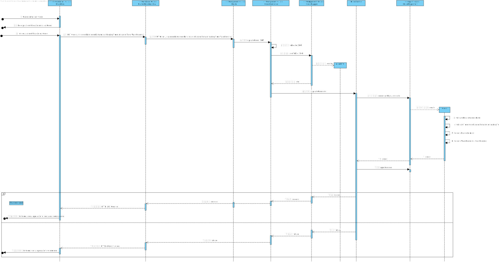

# UC 6

## 1. Requisitos
As Warehouse Employee, I want to costumize deliveries.

###Acceptance Criteria

**AC1:** O ID do warehouse de destino tem de existir!

**AC2:** A data de order tem de ser maior que a data atual.

## 2. Análise

## 2.1. Informação

Segundo os requesitos do cliente, a order terá de ser desenvolvido através de uma API em dotnet, usando a linguagem C#.
Iremos testar a edição da Order fazendo Put Requests á API através do software PostMan pois ainda não temos o FrontEnd implementado.

## 2.2. Análise

Esta é a estrutura de analise de armazém que chegamos segundo o cliente:

Durante a alteração da Order, o Armazém que é colocado no request terá de existir.

Foi criado duas situações: uma em que o utilizador altera só uma order ou alterar várias, como ainda não temos UI para
poder colocar a situação de mudar várias orders, só temos implementado a alteração de uma encomeda pois só acontece uma request.
O utilizador envia a informação para o sistema, mencionando o ID da Order e as suas alterações, se as alterações serem possiveis o sistema
altera a order.

## 3. Design

# 3.1 Informação

 A arquitetura usada para a realização desta US foi o DDD (Domain-Driven Design), onde
o Controller dos Armazéms recebe os requests do cliente e converte o body da request nos objetos
necessários para o funcionamento da US, o Controller irá chamar o Service que será responsável em exercer as funções necessárias
para a satisfação da US. O Service chamará o repositório que fará as comunicações necessárias com a Base de dados.

# 3.2 Vistas de Design

Como podemos obervar no VP, após o PUT request que o cliente envia á API, o Controller converte o corpo num DTO, este será enviado para o Service,
o service terá a responsabilidade de construir o objeto Armazém, o Domínio terá a responsabilidade de verificar se os atributos dos objetos respeitam
as regras de negócio do cliente, após o Service ter fabricado o objeto, irá enviar para o repositório que terá o objetivo
de fazer as comunicações necessárias para atualizar o objeto á Base de Dados.

No fim se tudo correr como foi mencionado, a API enviará ao cliente um 200 OK avisando que o sistema
fez a operação com sucesso se não enviará um 400 avisando que algo da request do cliente não estã bem estruturado ou não
respeita as regras de negócio do cliente.

# 3.3 Padrões Aplicados

* DDD (Persistence Ignorance, Entity, Value Object, Domain Service, Aggregate, Domain Event, Observer, Events);
* GRASI (Information Expert, Creator, Controller, Low Coupling (evaluative), High Cohesion (evaluative), Polymorphism, Pure Fabrication, Indirection, Protected Variations);
    + Information Expert - The service, since has a direct connection with the repositories, in this case, knows all domain concepts from this specific Use Case;
    + Low Coupling and High Cohesion, since we are using a lot of structured layers, all with a specific meaning, we are applying this pattern aswell;

* Data Transfer Object (DTO) pattern;
    + In order to abstract the entities and value objects from the domain layer or business layer we implement DTOs to abstract the UI Layer from the Domain Layer;

## Tests

### Integration Testing

* Modifica uma Order, através do Update

    [Fact]
    public void UpdateAsyncTest_ShouldUpdateAnWarehouseReturningAnOrderDTO()
    {
        //ARRANGE
        var en = new Order(new OrderDomainId("5", "221227"), new OrderDate(DateTime.Parse("2022-12-27")),
            new OrderMass(10), new TimeOrder(120), new TimeOrder(120), "A12");
        
        var creatingOrderDto = new CreatingOrderDto("2022-12-27", 10, 120, 120, "A12");

        var orderDto = OrderDtoParser.convertToDto(en);
        
        //ACT
        _repositoryEnMock.Setup(x => x.UpdateAsync(en)).ReturnsAsync(en);
        _repositoryEnMock.Setup(x => x.AddAsync(en)).ReturnsAsync(en);
        var result = _controller.AddAsync(creatingOrderDto).Result;

        var objExpected = orderDto;
        var objActual = result.Value;

        objActual = orderDto;
        
        var obj1StrExpected = JsonConvert.SerializeObject(objExpected);
        var obj2StrActual = JsonConvert.SerializeObject(objActual);

        //ASSERT
        Assert.Equal(obj1StrExpected, obj2StrActual);
    }

###Unit Testing

####Controller Testing
* Modifica uma Order

    [Fact]
    public void UpdateAsyncTest_ShouldUpdateAnWarehouseReturningAnOrderDTO()
    {
        //ARRANGE
        var en = new Order(new OrderDomainId("5", "221227"), new OrderDate(DateTime.Parse("2022-12-27")),
            new OrderMass(10), new TimeOrder(120), new TimeOrder(120), "A12");
        
        var creatingOrderDto = new CreatingOrderDto("2022-12-27", 10, 120, 120, "A12");

        var orderDto = OrderDtoParser.convertToDto(en);
        
        //ACT
        _ServiceMock.Setup(x => x.UpdateAsync(en.Id,creatingOrderDto)).ReturnsAsync(orderDto);
        var result = _controller.Update(en.Id.AsGuid(),creatingOrderDto).Result;

        var objExpected = orderDto;
        var objActual = orderDto;

        var obj1StrExpected = JsonConvert.SerializeObject(objExpected);
        var obj2StrActual = JsonConvert.SerializeObject(objActual);

        //ASSERT
        Assert.Equal(obj1StrExpected, obj2StrActual);
    }

####Service Testing
* Modifica uma Order

    [Fact]
    public void UpdateAsyncTest_ShouldUpdateAnOrder()
    {
        //ARRANGE
        var list = new List<Order>();

        var en = new Order(new OrderDomainId("5", "220505"),
            new OrderDate(DateTime.Parse("2022-12-27")), new OrderMass(10), new TimeOrder(120),
            new TimeOrder(120), "A12");

        var creatingOrderDto = new CreatingOrderDto("2022-12-27", 10, 120, 120, "A12");
        list.Add(en);

        //ACT
        _repositoryMock.Setup(x => x.UpdateAsync(en)).ReturnsAsync(en);

        var resultDTO = OrderDtoParser.convertToDto(en);
        var result = _service.UpdateAsync(en.Id, creatingOrderDto);
        var resultAlt = resultDTO;

        var obj1StrExpected = JsonConvert.SerializeObject(resultAlt.ToString());
        var obj2StrActual = JsonConvert.SerializeObject(resultDTO.ToString());

        //ASSERT
        Assert.Equal(obj1StrExpected, obj2StrActual);
    }
    
##System Test

								{
									"name": "Put_Order",
									"event": [
										{
											"listen": "test",
											"script": {
												"exec": [
													"pm.test(\"Status code is 200\", function () {\r",
													"    pm.response.to.have.status(200);\r",
													"});\r",
													"\r",
													"pm.test(\"Response time is less than 450ms\", function () {\r",
													"    pm.expect(pm.response.responseTime).to.be.below(450);\r",
													"});\r",
													"\r",
													"pm.test(\"Put With Success (Verify body)\", function () {\r",
													"    pm.response.to.have.body(\r",
													"{\r",
													"     \"id\": {\r",
													"        \"value\": pm.collectionVariables.get(\"id_order\")\r",
													"    },\r",
													"    \"identifier\": pm.collectionVariables.get(\"identifier\"),\r",
													"    \"orderDate\": \"12/20/2022 00:00:00\",\r",
													"    \"orderMass\": 5000.0,\r",
													"    \"chargingTime\": 100.0,\r",
													"    \"unloadingTime\": 200.0,\r",
													"    \"warehouseId\": \"CZ7\"\r",
													"});\r",
													"});"
												],
												"type": "text/javascript"
											}
										}
									],
									"request": {
										"method": "PUT",
										"header": [],
										"body": {
											"mode": "raw",
											"raw": "{\r\n    \"OrderDate\": \"20-12-2022\",\r\n    \"OrderMass\": 5000,\r\n    \"ChargingTime\": 100,\r\n    \"UnloadingTime\": 200,\r\n    \"WarehouseID\": \"CZ7\"\r\n}",
											"options": {
												"raw": {
													"language": "json"
												}
											}
										},
										"url": {
											"raw": "http://localhost:5000/api/Order/{{id_order}}",
											"protocol": "http",
											"host": [
												"localhost"
											],
											"port": "5000",
											"path": [
												"api",
												"Order",
												"{{id_order}}"
											]
										}
									},
									"response": []
								},
								{
									"name": "Delete_Order",
									"event": [
										{
											"listen": "test",
											"script": {
												"exec": [
													"pm.test(\"Status code is 200\", function () {\r",
													"    pm.response.to.have.status(200);\r",
													"});\r",
													"\r",
													"pm.test(\"Response time is less than 500ms\", function () {\r",
													"    pm.expect(pm.response.responseTime).to.be.below(500);\r",
													"});"
												],
												"type": "text/javascript"
											}
										}
									],
									"request": {
										"method": "DELETE",
										"header": [],
										"url": {
											"raw": "https://localhost:5001/api/Order/{{id_order}}",
											"protocol": "https",
											"host": [
												"localhost"
											],
											"port": "5001",
											"path": [
												"api",
												"Order",
												"{{id_order}}"
											]
										}
									},
									"response": []
								}
							]
						}
					]
				},