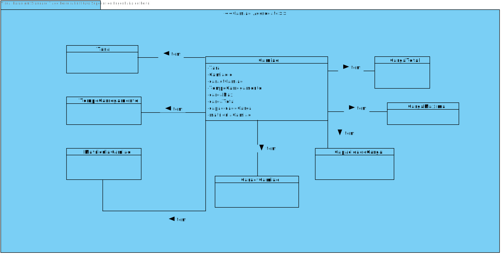
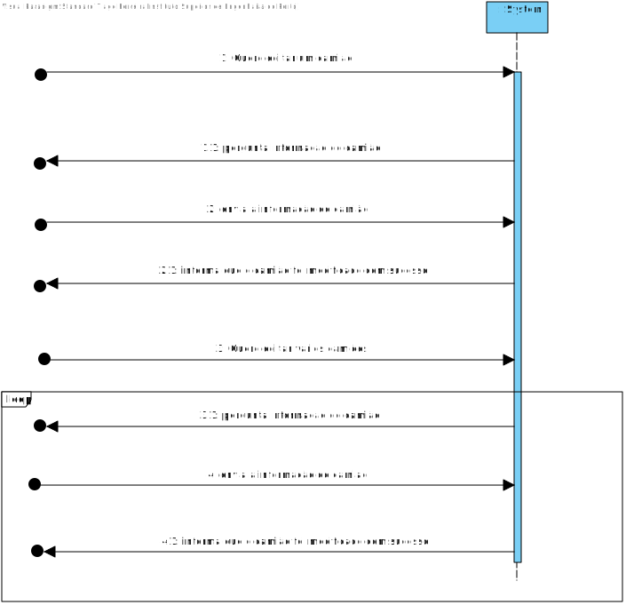
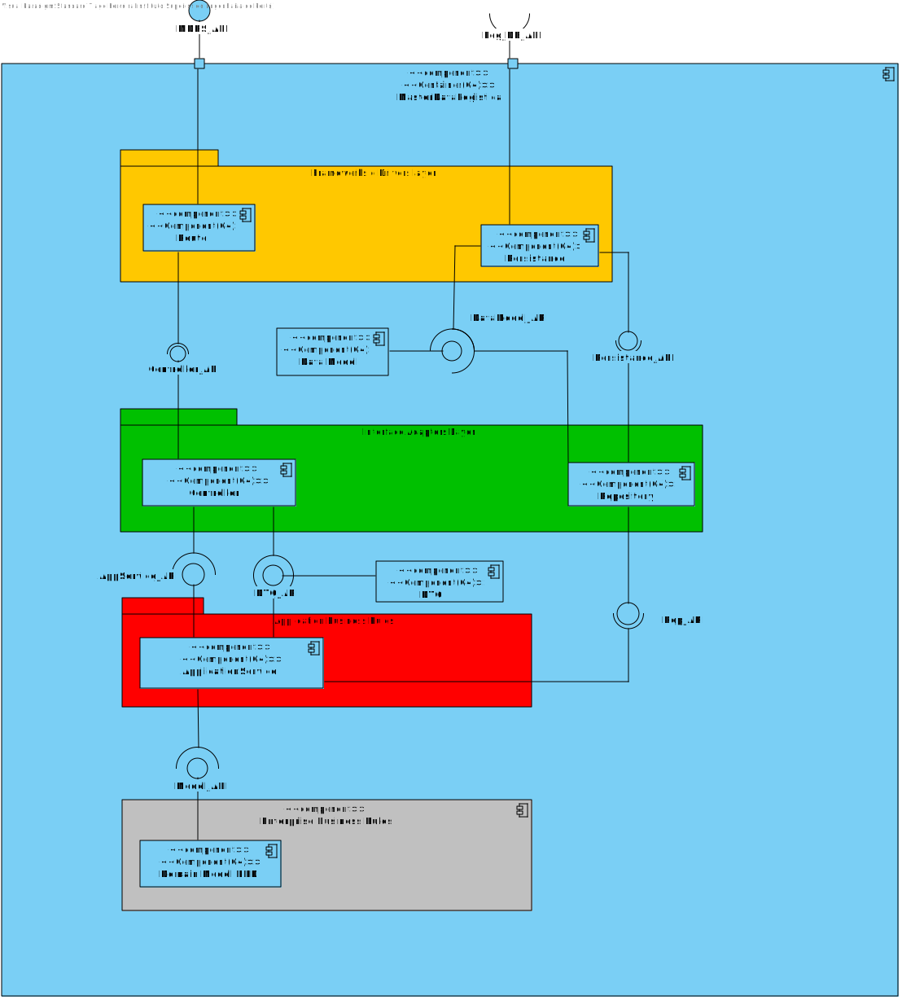
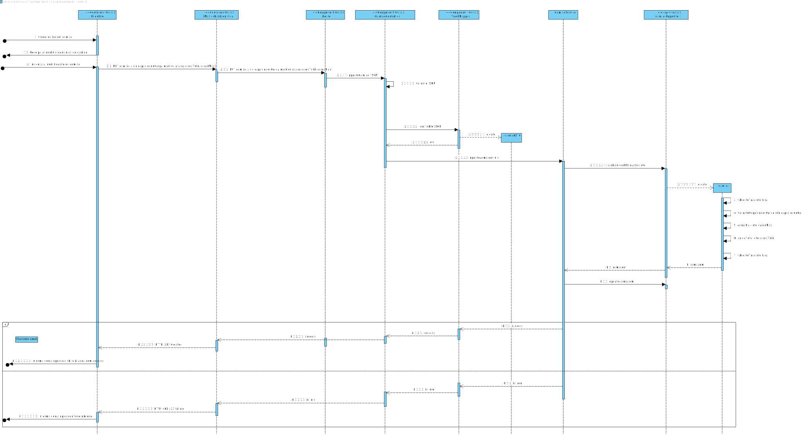

# UC 9


## 1. Requisitos
As Fleet Manager, I want to costumize truck.

###Acceptance Criteria

**AC1:** A matricula terá de ser com a estrutura letra letra - numero numero - letra letra

**AC2:** A Tara não pode ser positiva.


## 2. Análise

## 2.1. Informação

Segundo os requesitos do cliente, a encomenda terá de ser desenvolvido através de uma API em dotnet, usando a linguagem C#.
Iremos testar a edição da Encomenda fazendo Put Requests á API através do software PostMan pois ainda não temos o FrontEnd implementado.

## 2.2. Análise

Esta é a estrutura de analise de armazém que chegamos segundo o cliente:



Durante a alteração da Encomenda, o Armazém que é colocado no request terá de existir.



Foi criado duas situações: uma em que o utilizador altera só um camião ou alterar vários, como ainda não temos UI para
poder colocar a situação de mudar vários camiões, só temos implementado a alteração de uma encomeda pois só acontece uma request.
O utilizador envia a informação para o sistema, mencionando o ID da Entrega e as suas alterações, se as alterações serem possiveis o sistema
altera a encomenda.

## 3. Design

# 3.1 Informação

A arquitetura usada para a realização desta US foi o DDD (Domain-Driven Design), onde
o Controller dos Armazéms recebe os requests do cliente e converte o body da request nos objetos
necessários para o funcionamento da US, o Controller irá chamar o Service que será responsável em exercer as funções necessárias
para a satisfação da US. O Service chamará o repositório que fará as comunicações necessárias com a Base de dados.

# 3.2 Vistas de Design






Como podemos obervar no VP, após o PUT request que o cliente envia á API, o Controller converte o corpo num DTO, este será enviado para o Service,
o service terá a responsabilidade de construir o objeto Armazém, o Domínio terá a responsabilidade de verificar se os atributos dos objetos respeitam
as regras de negócio do cliente, após o Service ter fabricado o objeto, irá enviar para o repositório que terá o objetivo
de fazer as comunicações necessárias para atualizar o objeto á Base de Dados.

No fim se tudo correr como foi mencionado, a API enviará ao cliente um 200 OK avisando que o sistema
fez a operação com sucesso se não enviará um 400 avisando que algo da request do cliente não estã bem estruturado ou não
respeita as regras de negócio do cliente.

# 3.3 Padrões Aplicados


* DDD (Persistence Ignorance, Entity, Value Object, Domain Service, Aggregate, Domain Event, Observer, Events);
* GRASI (Information Expert, Creator, Controller, Low Coupling (evaluative), High Cohesion (evaluative), Polymorphism, Pure Fabrication, Indirection, Protected Variations);
    + Information Expert - The service, since has a direct connection with the repositories, in this case, knows all domain concepts from this specific Use Case;
    + Low Coupling and High Cohesion, since we are using a lot of structured layers, all with a specific meaning, we are applying this pattern aswell;


* Data Transfer Object (DTO) pattern;
    + In order to abstract the entities and value objects from the domain layer or business layer we implement DTOs to abstract the UI Layer from the Domain Layer;


## Tests


###Unit Testing

 * Return a valid result when updating camiao

 ```     it('should return a valid result when succeeding updating a camiao', async function() {
    //mocks camiaoRepository
    const camiaoRepo = {
      save: sinon.stub().returns(Promise.resolve(Camiao.create({
        caractCamiao: "E1234",
        matriculaCamiao: "AA-BB-DD",
        capacidadeCarga: 1000,
        cargaMax: 1000,
        cargaTotal: 1000,
        tara: 1000,
        tempoCarregamento: 1
      }))),
      findByDomainId: sinon.stub().returns(Promise.resolve(Camiao.create({
        caractCamiao: "E1234",
        matriculaCamiao: "AA-BB-DD",
        capacidadeCarga: 1000,
        cargaMax: 1000,
        cargaTotal: 1000,
        tara: 1000,
        tempoCarregamento: 1
      }))),
      update: sinon.stub().returns(Promise.resolve(Result.ok<Camiao>())),
      findByCaractCamiao: sinon.stub().returns(Promise.resolve(new Array((Camiao.create({
        caractCamiao: "E1234",
        matriculaCamiao: "AA-BB-DD",
        capacidadeCarga: 1000,
        cargaMax: 1000,
        cargaTotal: 1000,
        tara: 1000,
        tempoCarregamento: 1
      }))))),
      getAllCamioes: sinon.stub().returns(Promise.resolve(new Array((Camiao.create({
        caractCamiao: "E1234",
        matriculaCamiao: "AA-BB-DD",
        capacidadeCarga: 1000,
        cargaMax: 1000,
        cargaTotal: 1000,
        tara: 1000,
        tempoCarregamento: 1
      }))))),
      getByCaractAsync: sinon.stub().returns(Promise.resolve(new Array((Camiao.create({
        caractCamiao: "E1234",
        matriculaCamiao: "AA-BB-DD",
        capacidadeCarga: 1000,
        cargaMax: 1000,
        cargaTotal: 1000,
        tara: 1000,
        tempoCarregamento: 1
      }))))),
      getByMatriculaAsync: sinon.stub().returns(Promise.resolve(new Array((Camiao.create({
        caractCamiao: "E1234",
        matriculaCamiao: "AA-BB-DD",
        capacidadeCarga: 1000,
        cargaMax: 1000,
        cargaTotal: 1000,
        tara: 1000,
        tempoCarregamento: 1
      }))))),
      deleteCamiao: sinon.stub().returns(Promise.resolve(true))
    }

    const camiaoService = require('../../../src/services/camiaoService');
    const camiaoServiceInstance = new camiaoService.default(camiaoRepo);

    const camiaoDTO = {
      caractCamiao: "E1234",
      matriculaCamiao: "AA-BB-DD",
      capacidadeCarga: 1000,
      cargaMax: 1000,
      cargaTotal: 1000,
      tara: 1000,
      tempoCarregamento: 10
    };

    try{
      const result = await camiaoServiceInstance.updateCamiao(camiaoDTO);

      sinon.assert.match(result.isSuccess, true);
    } catch (E) {

    }
    });
```


  * Return an invalid result update camiao


```it('should return a invalid result when failing updating a camiao', async function() {
//mocks camiaoRepository
const camiaoRepo = {
save: sinon.stub().returns(Promise.resolve(Camiao.create({
caractCamiao: "E1234",
matriculaCamiao: "AA-BB-DD",
capacidadeCarga: 1000,
cargaMax: 1000,
cargaTotal: 1000,
tara: 1000,
tempoCarregamento: 1
}))),
findByDomainId: sinon.stub().returns(Promise.resolve(Camiao.create({
caractCamiao: "E1234",
matriculaCamiao: "AA-BB-DD",
capacidadeCarga: 1000,
cargaMax: 1000,
cargaTotal: 1000,
tara: 1000,
tempoCarregamento: 1
}))),
update: sinon.stub().returns(Promise.resolve(Result.ok<Camiao>())),
findByCaractCamiao: sinon.stub().returns(Promise.resolve(new Array((Camiao.create({
caractCamiao: "E1234",
matriculaCamiao: "AA-BB-DD",
capacidadeCarga: 1000,
cargaMax: 1000,
cargaTotal: 1000,
tara: 1000,
tempoCarregamento: 1
}))))),
getAllCamioes: sinon.stub().returns(Promise.resolve(new Array((Camiao.create({
caractCamiao: "E1234",
matriculaCamiao: "AA-BB-DD",
capacidadeCarga: 1000,
cargaMax: 1000,
cargaTotal: 1000,
tara: 1000,
tempoCarregamento: 1
}))))),
getByCaractAsync: sinon.stub().returns(Promise.resolve(new Array((Camiao.create({
caractCamiao: "E1234",
matriculaCamiao: "AA-BB-DD",
capacidadeCarga: 1000,
cargaMax: 1000,
cargaTotal: 1000,
tara: 1000,
tempoCarregamento: 1
}))))),
getByMatriculaAsync: sinon.stub().returns(Promise.resolve(new Array((Camiao.create({
caractCamiao: "E1234",
matriculaCamiao: "AA-BB-DD",
capacidadeCarga: 1000,
cargaMax: 1000,
cargaTotal: 1000,
tara: 1000,
tempoCarregamento: 1
}))))),
deleteCamiao: sinon.stub().returns(Promise.resolve(true))
}

    const camiaoService = require('../../../src/services/camiaoService');
    const camiaoServiceInstance = new camiaoService.default(camiaoRepo);

    const camiaoDTO = {
      caractCamiao: "E1234",
      matriculaCamiao: "AA-BB-DD",
      capacidadeCarga: 1000,
      cargaMax: 1000,
      cargaTotal: 1000,
      tara: 1000,
      tempoCarregamento: 10
    };

    try{
      const result = await camiaoServiceInstance.updateCamiao(camiaoDTO);

      sinon.assert.match(result.isSuccess, false);
    } catch (E) {

    }
});```
