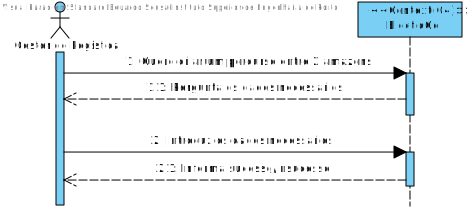
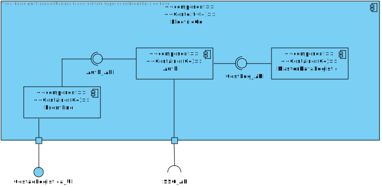
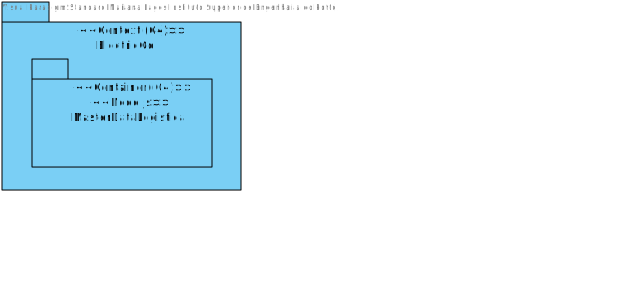
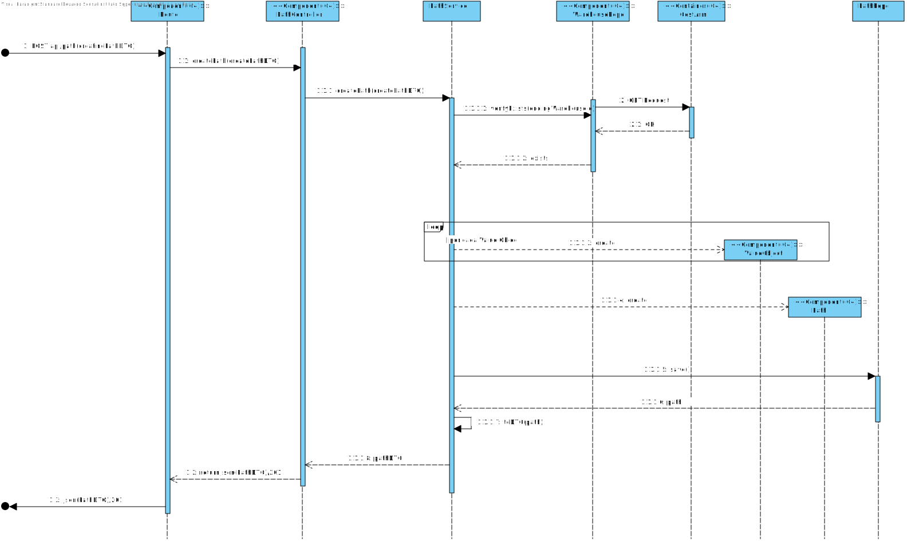

### 

## Contents
- [Decisões de Arquitetura tomadas](#decisões-de-arquitetura-tomadas)
- [Views:](#views)
  - [Nível 1](#nível-1)
    - [Vista Lógica](#vista-lógica)
    - [Vista de Cenários](#vista-de-cenários)
    - [Vista Processo](#vista-processo)
  - [Nível 2](#nível-2)
    - [Vista Lógica](#vista-lógica-1)
    - [Vista de Implementação](#vista-de-implementação)
    - [Vista Processo](#vista-processo-1)
  - [Nível 3 (MDR)](#nível-3-mdr)
    - [Vista Lógica](#vista-lógica-2)
    - [Vista Processo](#vista-processo-2)
    - [Vista de Implementação](#vista-de-implementação-1)

## Introduction
Será adotada a combinação de dois modelos de representação arquitetural: C4 e 4+1.

O Modelo de Vistas 4+1 [[Krutchen-1995]](References.md#Kruchten-1995) propõe a descrição do sistema através de vistas complementares permitindo, assim, analisar separadamente os requisitos dos vários stakeholders do software, tais como utilizadores, administradores de sistemas, project managers, arquitetos e programadores. As vistas são, deste modo, definidas da seguinte forma:

- Vista lógica: relativa aos aspetos do software visando responder aos desafios do negócio;
- Vista de processos: relativa ao fluxo de processos ou interações no sistema;
- Vista de desenvolvimento: relativa à organização do software no seu ambiente de desenvolvimento;
- Vista física: relativa ao mapeamento dos vários componentes do software em hardware, i.e. onde é executado o software;
- Vista de cenários: relativa à associação de processos de negócio com atores capazes de os espoletar.

O Modelo C4 [[Brown-2020]](References.md#Brown-2020)[[C4-2020]](References.md#C4-2020) defende a descrição do software através de quatro níveis de abstração: sistema, contentor, componente e código. Cada nível adota uma granularidade mais fina que o nível que o antecede, dando assim acesso a mais detalhe de uma parte mais pequena do sistema. Estes níveis podem ser equiparáveis a mapas, e.g. a vista de sistema corresponde ao globo, a vista de contentor corresponde ao mapa de cada continente, a vista de componentes ao mapa de cada país e a vista de código ao mapa de estradas e bairros de cada cidade.
Diferentes níveis permitem contar histórias diferentes a audiências distintas.

Os níveis encontram-se definidos da seguinte forma:
- Nível 1: Descrição (enquadramento) do sistema como um todo;
- Nível 2: Descrição de contentores do sistema;
- Nível 3: Descrição de componentes dos contentores;
- Nível 4: Descrição do código ou partes mais pequenas dos componentes (e como tal, não será abordado neste DAS/SAD).

Pode-se dizer que estes dois modelos se expandem ao longo de eixos distintos, sendo que o Modelo C4 apresenta o sistema com diferentes níveis de detalhe e o Modelo de Vista 4+1 apresenta o sistema de diferentes perspetivas. Ao combinar os dois modelos, torna-se possível representar o sistema de diversas perspetivas, cada uma com vários níveis de detalhe.

Para modelar/representar visualmente, tanto o que foi implementado como as ideias e alternativas consideradas, recorre-se à Unified Modeling Language (UML) [[UML-2020]](References.md#UML-2020) [[UMLDiagrams-2020]](References.md#UMLDiagrams-2020).

# Decisões de Arquitetura tomadas
As decisões geral de Arquitetura já estão descritas no documeto geral de Arquitetura. Este documento apenas descreve as decisões tomadas para este caso de uso.
O caso de uso pode ser visto como um caso de uso "classico" de criação de um objeto e persistencia do mesmo num repositório. Neste caso usamos inversão de dependencias e injeção de dependendias, para assim termos as camadas de software desacopladas.

Existe, porem, uma questão importante que merece a nossa atenção: para a criação de um caminho é necessário verificar que os armazens de inicio e fim deste caminho existem e sáo validos. Os dados de armazem encontram-se na API de Gestão de Armazem, pelo que é necessário efetuar um request a esta API. Seguindo a arquitetura Onion, a camada de aplicação não pode ter dependencias com a camada de infraestrutura, pelo que não podemos fazer o request diretamente. Para resolver este problema, foi criado um componente de Infraestrutura que é responsável por fazer o request à API de Gestão de Armazem. Este componente é injetado na camada de aplicação, permitindo assim que a camada de aplicação possa fazer o request à API de Gestão de Armazem. Este componente, embora possa ser visto como uma aplicação do padrão Command, é considerado como uma implementação de um repositório, de modo a "standardizar" a forma como os dados são obtidos. Podemos afirmar, no entanto que utilizamos o padrão Adapter, pois o componente de Infraestrutura é responsável por adaptar a API de Gestão de Armazem à forma como a camada de aplicação espera receber os dados.

# Views:

## Nível 1
### Vista Lógica

### Vista de Cenários

### Vista Processo

## Nível 2
### Vista Lógica

### Vista de Implementação

### Vista Processo

 

## Nível 3 (MDR)

### Vista Lógica

### Vista Processo

### Vista de Implementação
