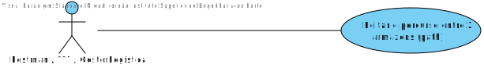
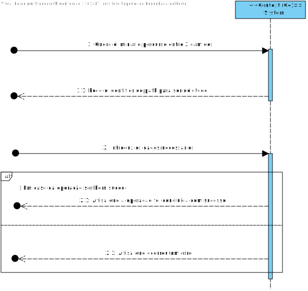
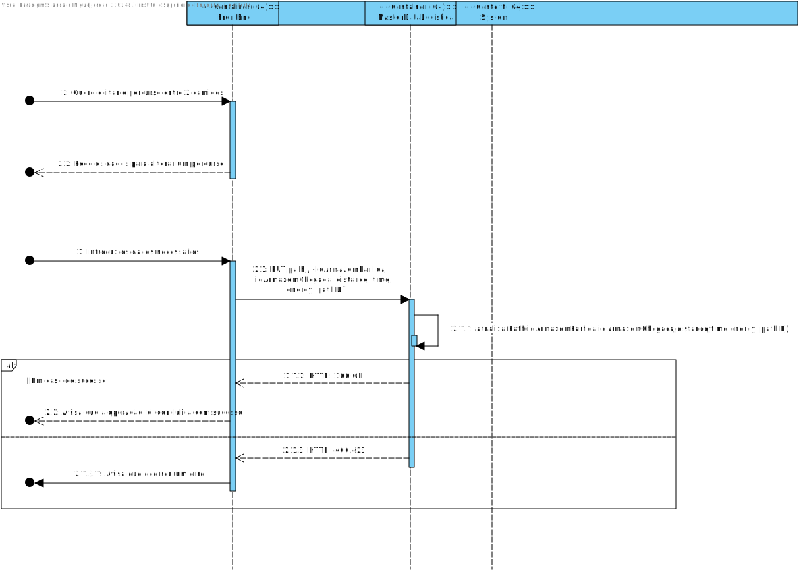
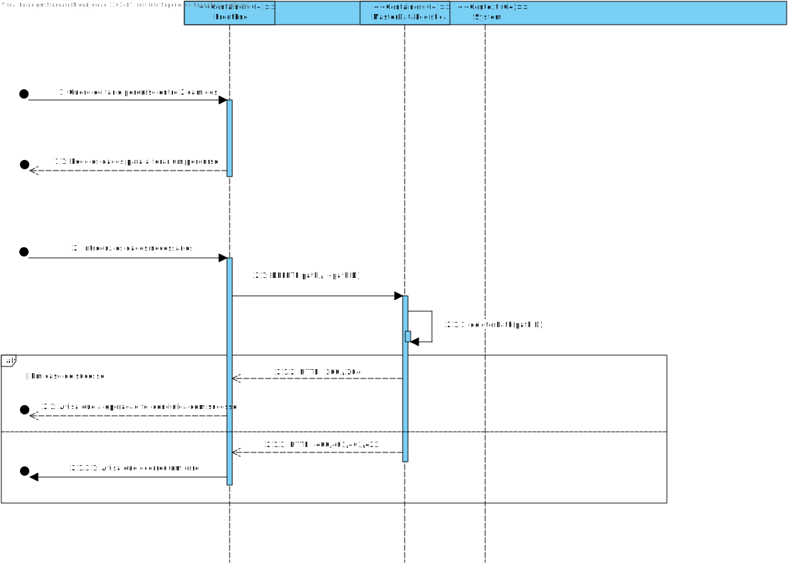
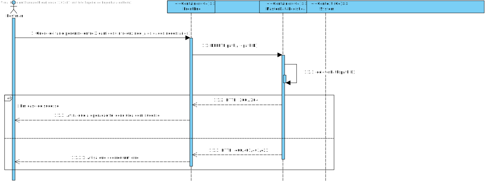
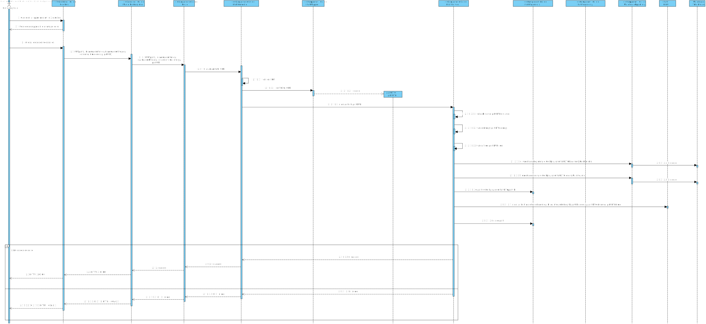

### 

## Contents
- [Views](#views)
	- [Introduction](#introduction)
	- [Nível 1](#nível-1)
		- [Vista Lógica](#vista-lógica)
		- [Vista de Cenários](#vista-de-cenários)
	- [Nível 2](#nível-2)
		- [Vista Lógica](#vista-lógica-1)
		- [Vista de Processos](#vista-de-processos)
		- [Vista de Implementação](#vista-de-implementação)
		- [Vista Física](#vista-física)
   - [Nível 3 (MDR)](#nível-3-mdr)
		- [Vista Lógica](#vista-lógica-2)
		- [Vista de Processos](#vista-de-processos-1)
		- [Vista de Implementação](#vista-de-implementação-1)
	- [Lista de Funcionalidades](Planeamento.md)
## Introduction
Será adotada a combinação de dois modelos de representação arquitetural: C4 e 4+1.

O Modelo de Vistas 4+1 [[Krutchen-1995]](References.md#Kruchten-1995) propõe a descrição do sistema através de vistas complementares permitindo assim analisar separadamente os requisitos dos vários stakeholders do software, tais como utilizadores, administradores de sistemas, project managers, arquitetos e programadores. As vistas são deste modo definidas da seguinte forma:

- Vista lógica: relativa aos aspetos do software visando responder aos desafios do negócio;
- Vista de processos: relativa ao fluxo de processos ou interações no sistema;
- Vista de desenvolvimento: relativa à organização do software no seu ambiente de desenvolvimento;
- Vista física: relativa ao mapeamento dos vários componentes do software em hardware, i.e. onde é executado o software;
- Vista de cenários: relativa à associação de processos de negócio com atores capazes de os espoletar.

O Modelo C4 [[Brown-2020]](References.md#Brown-2020)[[C4-2020]](References.md#C4-2020) defende a descrição do software através de quatro níveis de abstração: sistema, contentor, componente e código. Cada nível adota uma granularidade mais fina que o nível que o antecede, dando assim acesso a mais detalhe de uma parte mais pequena do sistema. Estes níveis podem ser equiparáveis a mapas, e.g. a vista de sistema corresponde ao globo, a vista de contentor corresponde ao mapa de cada continente, a vista de componentes ao mapa de cada país e a vista de código ao mapa de estradas e bairros de cada cidade.
Diferentes níveis permitem contar histórias diferentes a audiências distintas.

Os níveis encontram-se definidos da seguinte forma:
- Nível 1: Descrição (enquadramento) do sistema como um todo;
- Nível 2: Descrição de contentores do sistema;
- Nível 3: Descrição de componentes dos contentores;
- Nível 4: Descrição do código ou partes mais pequenas dos componentes (e como tal, não será abordado neste DAS/SAD).

Pode-se dizer que estes dois modelos se expandem ao longo de eixos distintos, sendo que o Modelo C4 apresenta o sistema com diferentes níveis de detalhe e o Modelo de Vista 4+1 apresenta o sistema de diferentes perspetivas. Ao combinar os dois modelos torna-se possível representar o sistema de diversas perspetivas, cada uma com vários níveis de detalhe.

Para modelar/representar visualmente, tanto o que foi implementado como as ideias e alternativas consideradas, recorre-se à Unified Modeling Language (UML) [[UML-2020]](References.md#UML-2020) [[UMLDiagrams-2020]](References.md#UMLDiagrams-2020).

# Analise de Requisitos
## Valores de Negócio e restrições
Caminho:
- Armazem de partida: String com id do armazem (3 caracteres alfanuméricos)
- Armazem de destino: String com id do armazem (3 caracteres alfanuméricos)
- Distancia: Inteiro positivo com a distancia entre os armazens
- Energie: Inteiro positivo com a energia necessária para percorrer a distancia
- Tempo: Inteiro positivo com o tempo necessário para percorrer a distancia
- Tempo de carregamento: Inteiro positivo com o tempo necessário para carregar o camião

# Decisões de Arquitetura tomadas
As decisões gerais de Arquitetura já estão descritas no documento geral de Arquitetura. Este documento apenas descreve as decisões tomadas para este caso de uso.
O caso de uso em questão é a edição de um caminho. Este foge à regra dos outros casos de uso "clássicos", já que necessita de uma interface de forma a fazer a junção do módulo de gestão de armazéns e o módulo de logística.

# Views:

# Nível 1
## Vista Lógica

Na vista lógica mostramos o Sistema como um todo e as possíveis comunicação com o exterior. 
O sistema (EletricGo) vai fornecer uma UI específica para o Gestor de Logística, sendo a Logística a **Master Data Logística**, 
uma aplicação a correr dentro do Sistema. O EletricGo também vai consumir uma API de autenticação exterior, conhecida como **SSO_API**.

### Vista de Cenários

Na vista de cenários apenas temos a interação desta UC que é a edição de um caminho.
Com edição o ator da UC vai poder tanto eliminar como editar o caminho.

## Vista Processo

### Alternativa 1

Na vista de processos, temos as interações básicas que o ator
(neste caso interpretamos que poderia tanto ser o ???, ator que reconhecemos como alguem que seja administrador do sistema
, visto que no **SPRINT A**` não existem atores explícitos) vai ter com o sistema para conseguir editar um caminho de forma correta.
Caso seja um ator, como por exemplo o ???, vai ter de ir introduzindo respetivamente as devidas informações até conseguir editar de forma correta o caminho (ou eliminar).

### Alternativa 2

Na segunda alternativa apresentada para o problema, o ator que faz os devidos requests é o postman, introduzindo já todas as informações necessárias para o desenvolver do fluxo da funcionalidade, não existindo assim uma interação mais explítica.

### Alternativa 3

Na terceira alternativa funciona exatamente como a alt1 mas reconhecemos o ??? como Gestor de Logística o qual vai participar de forma proatica com o sistema.

### Alternativa 4

Na quarta alternativa funciona exatamente como a alt1 mas seria se fosse o caso de eliminar um caminho.

### Alternativa 5

Na quinta alternativa funciona exatamente como a alt2 mas seria se fosse o caso de eliminar um caminho.

# Nível 2
## Vista Lógica

### Alternativa 1

Na vista lógica é possível observar as aplicações principais que estão presentes no decorrer da funcionalidade.
Neste caso é ilustrado um diagrama que já foi explicado várias vezes em sítios diferentes, existindo um "Front-end" que vai estabelecer
a user interface com os possíveis utilizadores e vai rencaminhar os pedidos entre os mesmos às devidas aplicações, neste caso ao **MASTER DATA ARMAZENS**.

### Alternativa 2

Na segunda alternativa proposta, funciona da mesma maneira que a primeira, existindo a diferença da presença da aplicação da "Autenticação", a mesma, como explicado várias vezes, vai servir de proxy para os pedidos e vai autenticar os mesmos.

### Alternativa 3

Na terceira alternativa, é ilustrado a base de dados interligada ao **MASTER DATA ARMAZEM** que mostra como são feitas as trocas de informação entre o mesmo. É necessário ilustrar a base de dados pois é lá que é persistido todas as informações necessárias para o funcionamento da aplicação.

### Alternativa 4 (2.5)

Esta alternativa é ilustrada para complementar a alternativa 3, tal como nos foi mostrar pelo o regente da cadeira, é possível existir esta interligação entre o mesmo, chamando a esta alternativa como um nível 2.5

## Vista de Implementação

Esta vista é simplesmente para ilustrar como está implementado a aplicação de **MASTER DATA GESTÃO ARMAZENS**, sendo a mesma em **.NET**.

## Vista Processo

### Alternativa 1

Tal como explicado anteriormente na vista de processos de nível 1, vai existir VÁRIAS alternativas a mostrar TODAS as possibilidades de comunicação entre a aplicação (no caso de ser a edição de um caminho ou a eliminação do mesmo).
Neste caso concreto vai ser a edição de um caminho pelo o ??? (admin do sistema).
A aplicação após receber o pedido do front-end vai interpretar os dados recebidos e condicionar uma resposta ao pedido(caso tenha sucesso o request).
No final, retorna uma mensagem consoante o despacho do fluxo, sendo este tanto sucesso como insucesso (avisando o utilizador com uma mensagem de erro e um código HTTP).

### Alternativa 2

Na alternativa 2, funciona exatamente como a alt1 mas apenas é diferenciada pelo o ator, sendo este o postman, que vai DIRETAMENTE, estabelecer um request estando o mesmo já estruturado (bem ou mal).

### Alternativa 3

Na alternativa 3 funciona exatamente como a alternativa 1, mas o ator é diferente, sendo este o possível responsável da funcionalidade, o gestor de logistica.

### Alternativa 4

Na alternativa 4, é ilustrado o processo caso seja preciso apagar o caminho inves de editar. O ator do mesmo vai ser o ??? (administrador), possibilitando assim o despacho desejado (a eliminação em si).

### Alternativa 5

Na alternativa 5 é igual à anterior sendo apenas diferente o facto que neste caso vai ser o postman a fazer o pedido.

### Alternativa 6

Na alternativa 6 é igual à anterior sendo apenas diferente o facto que neste caso vai ser o gestor de logística a fazer o pedido.

## Vista Física

### Alternativa 1

Na vista física é ilustrado como as aplicações vao correr em paralelo, sendo ilustrado, como a Aplicação de **MASTER DATA GESTÃO DE ARMAZENS** corre numa máquina diferente do **FRONT-END**, possibilitanto assim a abstração das aplicações em várias máquinas diferentes.
Neste caso particular, a aplicação do postman, que pode estar a correr nas próprias máquinas, vai fazer um pedido à maquina que está a hospedar a devida aplicação.

## Nível 3 (MDR)

## Vista Lógica

### Alternativa 1

Na vista lógica nível 3 é explicitado com mais rigor o funcionamento na aplicação **MASTER DATA GESTÃO ARMAZENS**.
A mesma obedece à **onion architecture**, sendo este bastante complexo no que toca em padrões arquiteturais.
A aplicação apresenta 4 camadas diferentes *Frameworks e Drivers Layers*, *Interfaces Adapter Layer*, *Application Bussiness Rules*, *Enterprise Bussiness Rules*, onde cada uma tem um nível de abstração diferente e responsabilidades muito diferentes.
Tal como é possível observar, na camada mais exterior, *frameworks e drivers layers* existe lá a route e a persistance, sendo estes os responsáveis por comunicar com o exterior, respetivamente receber os requests (REST), analisando o pedido e o seu body e rencaminhando para o correto controlador, enquanto que a persistance é responsável, tal como o nome indica, de persistir os dados na Base de Dados da aplicação (Neste caso na MongoDB hospedada nos Virtual Servers do DEI).
Posteriormente temos os controllers, que vão controlar o fluxo do decorrer da funcionalidade, chamando o respetivo serviço que tem lá dentro toda a lógica/regras de negócio intrísecas a esta funcionalidade.
Finalmente temos a camada de domínio que apresenta o CORE do negócio relacionado a esta entidade, ao empacotamento (existindo lá TODAS as regras de negócio).
No final, voltando novamente à camada do serviço, a mesma vai aceder ao seu devido repositório para conseguir fazer a persistência correta dos dados.
Por fim, o controlador vai reconstruir a informação obtida pelo o fluxo total, gerando assim a resposta ao pedido.

### Alternativa 2

Este diagrama é igual ao anterior, mas apenas difere na ligação do módulo da persistance à interface exposta pela base de dados (uma vez que o design anterior seria, por exemplo, para uma base de dados em memória, enquanto que, este diagrama menciona base de dados a serem hospedadas em outras máquinas, como por exemplo na cloud).

## Vista Processo

### Alternativa 1

Tal como mencinado previamente, finalmente temos uns diagramas mais complexos da vista de processos nível 3.
No caso desta UC, edição de um caminho, quando o serviço recebe o pedido rencaminhado pela Route, procede a realizar o que é necessário, sendo este a edição do caminho recebido.
Primeiro, vai verificar se existe o caminho em questão, uma vez que é necessário saber se vamos editar algo que existe ou não.
Posteriormente, caso seja possível confirmar que existe de facto o caminho, vai verificar se os NOVOS ARMAZENS, uma vez que é possível alterar tanto o destino como a origem de um caminho, se ambas existem, pois não podemos ir para LOCALIDADES INEXISTENTES.
Depois, finalmente, vai alterar, verificando também, tanto a energia que vai se gastar no caminho, o tempo de carregamento caso seja necessário, a distância de um armazém ao outro.
Por fim, remete a mensagem final de sucesso ou insucesso ao ator em questão, o ??? (admin), avisando caso tenha tido sucesso ou não o request, avisando o que potencialmente poderá ter corrido mal com uma mensagem de erro estrutura e um devido código HTTP associado (tanto no sucesso como falhanço).

### Alternativa 2

Na segunda alternativa, funciona exatamente igual à anterior mas neste caso o ator é diferente, sendo este o postman.

### Alternativa 3

Na terceira alternativa, funciona exatamente igual à anterior mas neste caso o ator é diferente, sendo este o gestor de logística em si.

### Alternativa 4

Na quarta alternativa o fluxo vai ser igual ao primeiro mas neste caso antes de alterar as informações vai apagar POR COMPLETO a entidade caminho em questão. Apenas vai receber o ID da mesma e vai verificar se existe, caso exista vai apagar o específico registo em consideração.
No final retorna uma mensagem de sucesso ou erro com um código associado (Sendo este 200 ou 404/400).
O ator em questão seria o ??? (admin).

### Alternativa 5

Na quinta alternativa, é igual à anterior mas apenas difere no fator do ator ser diferente, sendo este o postman.

### Alternativa 6

Por fim na última alternativa o ator é o gestor de logística e vai funcionar exatamente tal e qual como o anterior.

## Vista de Implementação

### Alternativa 1

Na vista de implementação nível 3 temos um insight das dependecias de cada camada, esta primeira alternativa mostra por alto as camadas, uma vez que numa próxima alternativa vai ilustrar melhor as camadas e dependências.

### Alternativa 2

Na segunda alternativa já é possível entender melhor o funcionamento das dependencias de cada camada e respetivos módulos, o fluxo vai ser igual ao explicado anteriormente.

### Alternativa 3

Finalmente, na alternativa 3, temos um insight MUITO mais técnico e funcional das dependências, sendo este como "uma lupa", pois mostra realmente até depedencias entre interfaces e devidos módulos.

