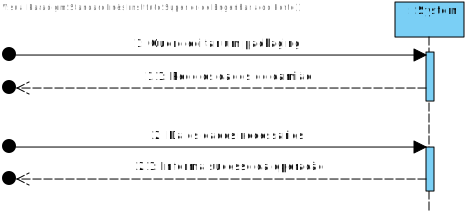
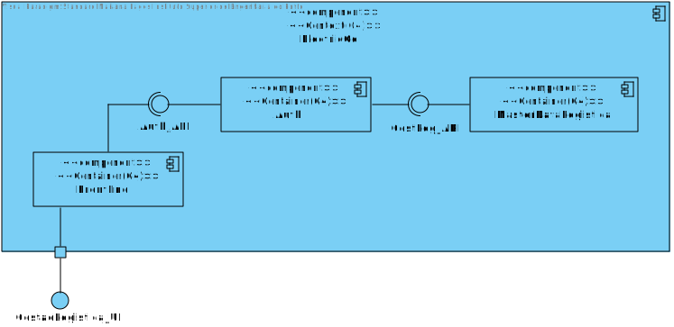
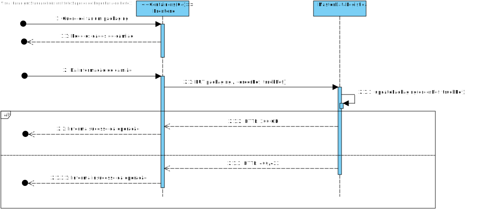
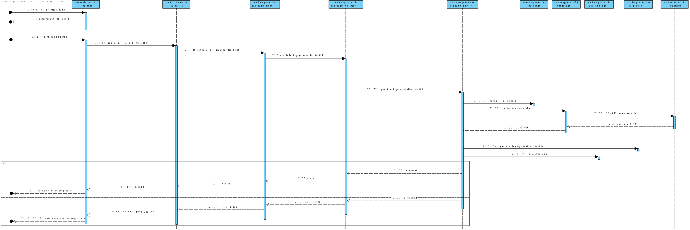

### 

## Contents
- [Decisões de Arquitetura tomadas](#decisões-de-arquitetura-tomadas)
- [Views:](#views)
  - [Nível 1](#nível-1)
    - [Vista Lógica](#vista-lógica)
    - [Vista de Cenários](#vista-de-cenários)
    - [Vista Processo](#vista-processo)
  - [Nível 2](#nível-2)
    - [Vista Lógica](#vista-lógica-1)
    - [Vista de Implementação](#vista-de-implementação)
    - [Vista Processo](#vista-processo-1)
  - [Nível 3 (MDR)](#nível-3-mdr)
    - [Vista Lógica](#vista-lógica-2)
    - [Vista Processo](#vista-processo-2)
    - [Vista de Implementação](#vista-de-implementação-1)

## Introduction
Será adotada a combinação de dois modelos de representação arquitetural: C4 e 4+1.

O Modelo de Vistas 4+1 [[Krutchen-1995]](References.md#Kruchten-1995) propõe a descrição do sistema através de vistas complementares permitindo, assim, analisar separadamente os requisitos dos vários stakeholders do software, tais como utilizadores, administradores de sistemas, project managers, arquitetos e programadores. As vistas são, deste modo, definidas da seguinte forma:

- Vista lógica: relativa aos aspetos do software visando responder aos desafios do negócio;
- Vista de processos: relativa ao fluxo de processos ou interações no sistema;
- Vista de desenvolvimento: relativa à organização do software no seu ambiente de desenvolvimento;
- Vista física: relativa ao mapeamento dos vários componentes do software em hardware, i.e. onde é executado o software;
- Vista de cenários: relativa à associação de processos de negócio com atores capazes de os espoletar.

O Modelo C4 [[Brown-2020]](References.md#Brown-2020)[[C4-2020]](References.md#C4-2020) defende a descrição do software através de quatro níveis de abstração: sistema, contentor, componente e código. Cada nível adota uma granularidade mais fina que o nível que o antecede, dando assim acesso a mais detalhe de uma parte mais pequena do sistema. Estes níveis podem ser equiparáveis a mapas, e.g. a vista de sistema corresponde ao globo, a vista de contentor corresponde ao mapa de cada continente, a vista de componentes ao mapa de cada país e a vista de código ao mapa de estradas e bairros de cada city.
Diferentes níveis permitem contar histórias diferentes a audiências distintas.

Os níveis encontram-se definidos da seguinte forma:
- Nível 1: Descrição (enquadramento) do sistema como um todo;
- Nível 2: Descrição de contentores do sistema;
- Nível 3: Descrição de componentes dos contentores;
- Nível 4: Descrição do código ou partes mais pequenas dos componentes (e como tal, não será abordado neste DAS/SAD).

Pode-se dizer que estes dois modelos se expandem ao longo de eixos distintos, sendo que o Modelo C4 apresenta o sistema com diferentes níveis de detalhe e o Modelo de Vista 4+1 apresenta o sistema de diferentes perspetivas. Ao combinar os dois modelos, torna-se possível representar o sistema de diversas perspetivas, cada uma com vários níveis de detalhe.

Para modelar/representar visualmente, tanto o que foi implementado como as ideias e alternativas consideradas, recorre-se à Unified Modeling Language (UML) [[UML-2020]](References.md#UML-2020) [[UMLDiagrams-2020]](References.md#UMLDiagrams-2020).

# Decisões de Arquitetura tomadas
As decisões gerais de Arquitetura já estão descritas no documento geral de Arquitetura. Este documento apenas descreve as decisões tomadas para este caso de uso.
O caso de uso em questão é a edição de um packaging. Este foge à regra dos outros casos de uso "clássicos", já que necessita de uma interface de forma a fazer a junção do módulo de gestão de armazéns e o módulo de logística.

# Views:

## Nível 1
### Vista Lógica

Na vista lógica mostramos o Sistema como um todo e as possíveis comunicação com o exterior. O sistema (EletricGo) vai fornecer uma UI específica para o Gestor de Logística, sendo a Logística a **Master Data Logística**, uma aplicação a correr dentro do Sistema. O EletricGo também vai consumir uma API de autenticação exterior, conhecida como **SSO_API**.

### Vista de Cenários

Na vista de cenários apenas temos a interação desta UC que é a edição de um epacotamento. Com edição o ator da UC vai poder tanto eliminar como editar o packaging.

### Vista Processo

Na vista de processos, temos as interações básicas que o ator (neste caso interpretamos que poderia tanto ser o Postman, visto que no **SPRINT A**` does not existm autores) em que vai ter de ser introduzido a referência a uma order válida e a referência válida a um camião. Tanto uma como a outra vão ser validadas mais tarde durante a edição do packaging, uma vez que é possível alterar as posições 3D do mesmo.

## Nível 2
### Vista Lógica

Na vista lógica nível 2, tal como já foi explicado nos diagramas gerais da aplicação **MASTER DATA GESTÃO LOGÍSTICA**, uma das possíveis arquiteturas para o sitema seria a existência de uma aplicação (**AUTH**) que vai fazer de proxy entre os vários requests dentro do sistema. Nesta UC apenas nos interessa a parte do front-end e da MasterDataLogística uma vez que os packagings fazem parte deste módulo. O ator vai ter que enviar um request que posteriormente vai ser interpretado pela Aplicação em si retornando uma possível mensagem de sucesso ou erro dependendo da operação.

### Vista Processo

Na vista lógica de nível 2, tal como explicado anteriormente, mostra de forma mais explícita a edição do packaging em si. Quando a aplicação **MASTER DATA LOGÍTICA** recebe o pedido, o mesmo vai interpretar o mesmo e realizar a tarefa que lhe foi proposta no pedido (neste preciso caso a edição do packaging ou mesmo a eliminação do mesmo). Após verificar a integridade das news posições ou o novo camião (uma vez que apenas é possível alterar a atribuição de um camião a uma order ou as suas devidas posiões dentro do camião) vai retornar uma mensagem de sucesso ou erro dependendo da operação em si.
 

## Nível 3 (MDR)

### Vista Lógica

Na vista lógica nível 3 é explicitado com mais rigor o funcionamento na aplicação **MASTER DATA LOGÍSTICA**.
A mesma obedece à **onion architecture**, sendo este bastante complexo no que toca em padrões arquiteturais.
A aplicação apresenta 4 camadas diferentes *Frameworks e Drivers Layers*, *Interfaces Adapter Layer*, *Application Bussiness Rules*, *Enterprise Bussiness Rules*, onde cada uma tem um nível de abstração diferente e responsabilidades muito diferentes.
Tal como é possível observar, na camada mais exterior, *frameworks e drivers layers* exists lá a route e a persistance, sendo estes os responsáveis por comunicar com o exterior, respetivamente receber os requests (REST), analisando o pedido e o seu body e rencaminhando para o correto controlador, enquanto que a persistance é responsável, tal como o nome indica, de persistir os dados na Base de Dados da aplicação (Neste caso na MongoDB hospedada nos Virtual Servers do DEI).
Posteriormente temos os controllers, que vão controlar o fluxo do decorrer da funcionalidade, chamando o respetivo serviço que tem lá dentro toda a lógica/regras de negócio intrísecas a esta funcionalidade.
Finalmente temos a camada de domínio que apresenta o CORE do negócio relacionado a esta entidade, ao packaging (existindo lá TODAS as regras de negócio).
No final, voltando newmente à camada do serviço, a mesma vai aceder ao seu devido repositório para conseguir fazer a persistência correta dos dados.
Por fim, o controlador vai reconstruir a informação obtida pelo o fluxo total, gerando assim a resposta ao pedido.

Este diagrama é igual ao posterior, mas apenas difere na ligação do módulo da persistance à interface exposta pela base de dados (uma vez que o design anterior seria, por exemplo, para uma base de dados em memória, enquanto que, este diagrama menciona base de dados a serem hospedadas em outras máquinas, como por exemplo na cloud).

### Vista Processo

Na vista de processos nível 3, finalmente, temos um "insight" correto do fluxo da funcionalidade na sua totalidade.

Primeiro vai verificar se tanto a referência ao Camião como a referência à order são validas, isto é, se existsm. Caso does not existm, não vai ser possível alterar as informações do packaging retornando uma mensagem de erro e um código de um erro respetivo (Neste caso 400 -> Bad request).

Caso sejam informações válidas vai alterar as informações respetivas à posição do packaging no novo (ou não) camião estabelecido.

No final, caso seja sucesso, devolve uma mensagem de sucesso e um código respetivo, neste caso, um 200 -> OK.

### Vista de Implementação

Na vista de implementação nível 3 temos um insight das dependecias de cada camada, esta primeira alternativa mostra por alto as camadas, uma vez que numa próxima alternativa vai ilustrar melhor as camadas e dependências.

Na segunda alternativa já é possível entender melhor o funcionamento das dependencias de cada camada e respetivos módulos, o fluxo vai ser igual ao explicado anteriormente.

Finalmente, na alternativa 3, temos um insight MUITO mais técnico e funcional das dependências, sendo este como "uma lupa", pois mostra realmente até depedencias entre interfaces e devidos módulos.